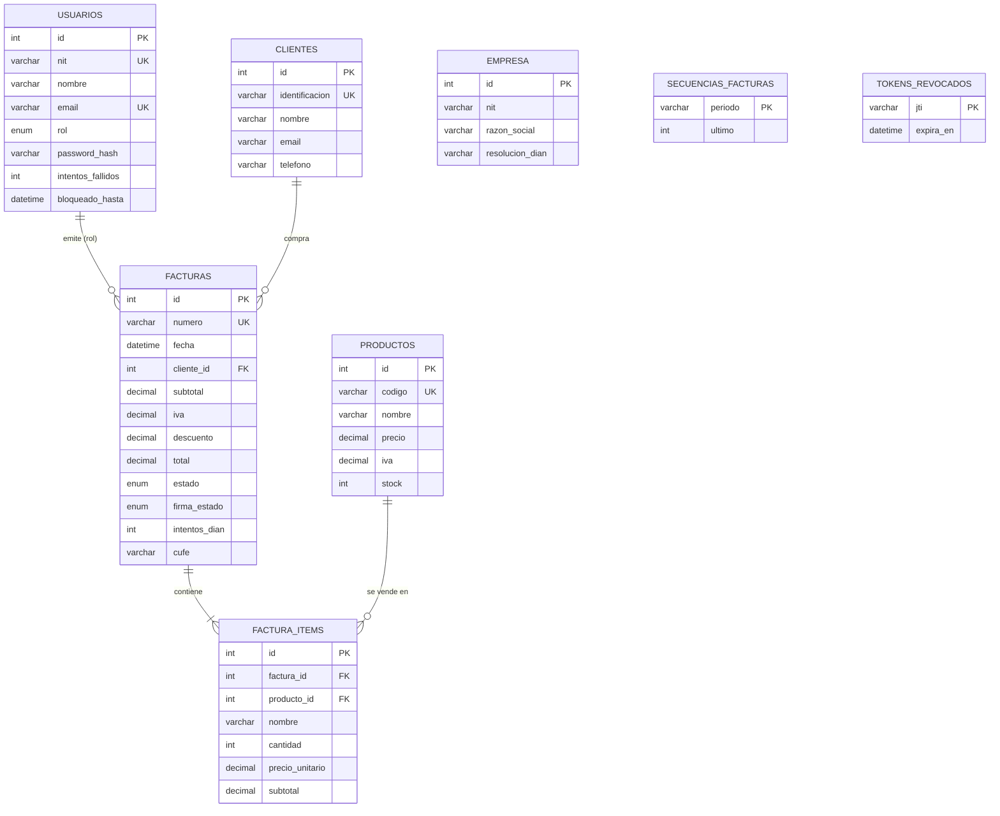

# FacturaExpress V3

Sistema de **facturación electrónica full-stack**: aplicación web **Angular 22** + API REST
**Node.js / Express** con base de datos **MySQL**, orientada a pequeñas y medianas empresas
colombianas (punto de venta, facturación con flujo DIAN, reportes y administración).

> Repositorio: <https://github.com/jhromero81/FacturaExpress_V3.git>

---

## 1. Tecnologías y stack utilizado

### Backend (API REST)

| Componente             | Tecnología                                  |
| ---------------------- | ------------------------------------------- |
| Entorno de ejecución   | Node.js                                     |
| Framework de backend   | Express.js                                  |
| Base de datos          | MySQL 8 (tablas relacionales)               |
| Driver de BD           | mysql2 (pool de conexiones)                 |
| Autenticación          | JSON Web Token (jsonwebtoken)               |
| Sesión segura          | Cookie httpOnly (cookie-parser)             |
| Cifrado de claves      | bcryptjs                                    |
| Cabeceras de seguridad | helmet                                      |
| Límite de peticiones   | express-rate-limit                          |
| Validación de entrada  | express-validator                           |
| Documentos             | pdfkit (PDF de facturas y reportes)         |
| Correo                 | nodemailer (envío de facturas por email)    |
| Variables de entorno   | dotenv                                      |
| CORS                   | cors (origen del frontend configurable)     |
| Pruebas                | node --test (100 pruebas en 9 archivos)     |
| Control de versiones   | Git + GitHub                                |

### Frontend (aplicación web)

| Componente            | Tecnología                                            |
| --------------------- | ----------------------------------------------------- |
| Framework             | Angular 22 (componentes standalone, sin NgModules)    |
| Lenguaje              | TypeScript (modo estricto, `strict` + `strictTemplates`) |
| Enrutado              | @angular/router con carga diferida (`loadComponent`)  |
| HTTP                  | HttpClient + interceptor funcional de sesión          |
| Estado reactivo       | Signals para estado local de componentes              |
| Estilos               | CSS global con variables (temas claro/oscuro/alto contraste) |
| Tipografías           | Roboto (texto) y Space Mono (números/código)          |
| Dev-server            | ng serve con proxy `/api` → `http://localhost:4000`   |
| Pruebas               | Vitest + jsdom (37 pruebas en 3 archivos)             |
| Formato de código     | Prettier (`frontend/.prettierrc.json`)                |

---

## 2. Estructura del proyecto

```
FacturaExpress_V3/
├── package.json                   # Scripts raíz del monorepo (setup, dev, test…)
├── package-lock.json              # Dependencias del orquestador raíz (concurrently)
├── .gitattributes                 # Finales de línea LF (compatibilidad Windows/Linux)
├── docker-compose.yml             # Orquestacion: MySQL 8 + API + frontend
├── .env.example                   # Plantilla de variables para Docker Compose
├── .github/workflows/ci.yml       # CI: pruebas backend, auditoria de dependencias,
│                                  # pruebas + build del frontend y aceptacion E2E
├── backend/                       # API REST Node.js + Express + MySQL
│   ├── package.json               # Dependencias y scripts
│   ├── .env.example               # Plantilla de variables de entorno
│   ├── .dockerignore              # Excluye node_modules/.env de la imagen
│   ├── Dockerfile                 # Imagen Docker (Node 18 Alpine, usuario node)
│   ├── server.js                  # Punto de entrada de la API
│   ├── config/
│   │   ├── db.js                  # Pool de conexiones MySQL
│   │   ├── jwt.js                 # Firma/verificacion de tokens (issuer y audience)
│   │   └── password.js            # Politica de contrasenas (min. 8, mayuscula y digito)
│   ├── controllers/               # auth, clientes, productos, facturas, configuracion,
│   │                              # reportes, usuarios, errores, logs, backup
│   ├── routes/                    # 10 archivos de rutas (uno por modulo)
│   ├── middleware/
│   │   ├── auth.js                # JWT (cookie httpOnly o Bearer) + autorizacion por rol
│   │   ├── errorHandler.js        # 404, errores centrales, asyncHandler
│   │   ├── security.js            # Limites de peticiones (login, anonimo y autenticado)
│   │   └── validate.js            # Verificador central de validaciones (400)
│   ├── validators/index.js        # Reglas de validacion por modulo
│   ├── services/                  # backup.service.js, email.service.js, pdf.service.js
│   ├── utils/                     # helpers.js, cune.js (hash CUFE), auditoria.js, errores.js
│   ├── db/
│   │   ├── schema.sql             # Creacion de BD y 12 tablas
│   │   └── seedData.js            # Datos iniciales para el seed
│   ├── scripts/                   # setupDb.js, migrate.js, seed.js, pruebas-aceptacion.js
│   └── test/                      # 9 suites: 100 pruebas (74 unitarias + 26 de integracion)
├── frontend/                      # Aplicación web Angular 22
│   ├── proxy.conf.json            # /api → http://localhost:4000
│   ├── angular.json               # Configuración del workspace
│   ├── .prettierrc.json           # Reglas de formato del frontend
│   ├── .dockerignore              # Excluye node_modules/dist de la imagen
│   ├── Dockerfile                 # Imagen multi-stage (build + nginx)
│   ├── nginx.conf                 # SPA + proxy /api al servicio api + CSP
│   ├── nginx-ssl.conf             # Variante HTTPS con HSTS
│   └── src/
│       ├── styles.css             # Sistema de diseño (variables y temas)
│       ├── environments/          # environment.ts / environment.development.ts
│       └── app/
│           ├── app.ts             # Componente raíz
│           ├── app.config.ts      # Providers raíz (router, http, zona)
│           ├── app.routes.ts      # Rutas con carga diferida por módulo
│           ├── app.spec.ts        # Prueba de arranque del componente raíz
│           ├── core/              # api.service, auth.service, guards, interceptors,
│           │                      # models, constants, formatters, toast.service, validators
│           └── features/
│               ├── layout/        # Shell: sidebar, topbar, router-outlet
│               ├── admin/         # auditoria, backup, errores, usuarios
│               ├── clientes/      # CRUD de clientes
│               ├── configuracion/ # Empresa emisora y configuracion DIAN
│               ├── dashboard/     # KPIs y graficos
│               ├── facturas/      # Listado, detalle (modal) y descargas
│               ├── login/         # Inicio de sesion
│               ├── productos/     # Catalogo e inventario
│               ├── reportes/      # Reportes y exportacion PDF
│               └── ventas/nueva-venta.component.*  # Punto de venta (POS)
├── postman/
│   ├── collections/               # Coleccion Postman (47 peticiones .request.yaml)
│   └── test-api.ps1               # Script auxiliar de ejecucion en Windows
├── docs/                          # Documentacion y evidencias (PDF / Markdown)
└── plans/                         # Planes internos de trabajo (excluido en .gitignore)
```

---

## 3. Modelo de datos



La base de datos `facturaexpress_apirest` contiene 12 tablas:

| Tabla                 | Descripción                                                              |
| --------------------- | ------------------------------------------------------------------------ |
| `usuarios`            | Perfiles de acceso (admin, vendedor, contador) con contraseña cifrada, contador de intentos fallidos y bloqueo temporal. |
| `clientes`            | Directorio de clientes (identificación, nombre, email, teléfono).        |
| `productos`           | Catálogo de productos (código, nombre, precio, IVA, stock).              |
| `facturas`            | Cabecera de factura con *snapshot* del cliente, totales, CUFE, estado DIAN y estado de firma. |
| `factura_items`       | Líneas de cada factura (producto, cantidad, precio, IVA, subtotal).      |
| `empresa`             | Datos de la empresa emisora y configuración fiscal DIAN (un registro).   |
| `errores_sistema`     | Registro de errores internos para monitoreo desde el módulo admin.       |
| `logs_auditoria`      | Bitácora de operaciones (usuario, acción, tabla, IP de origen).          |
| `reportes`            | Historial de reportes PDF generados.                                     |
| `backups`             | Metadatos de los respaldos SQL creados desde el módulo admin (archivo único y huella SHA-256). |
| `secuencias_facturas` | Consecutivo por periodo (`YYYYMM`) usado para numerar las facturas.      |
| `tokens_revocados`    | Identificadores `jti` de los JWT cerrados antes de su expiración.        |

> **Nota sobre integridad:** al crear una factura se guarda una copia del nombre e
> identificación del cliente (denormalización). Así el histórico fiscal no cambia si
> el cliente se edita o elimina posteriormente. La eliminación de clientes/productos
> es **lógica** (campo `activo = 0`). El esquema además declara `rol`, `estado` y
> `firma_estado` como `ENUM`, un `CHECK (stock >= 0)`, `UNIQUE` sobre `backups.archivo`,
> charset `utf8mb4` explícito por tabla e índices sobre las columnas de consulta
> frecuente (`reportes.created_at`, `tokens_revocados.expira_en`, entre otros).

---

## 4. Análisis de endpoints

Todas las rutas (excepto `POST /api/auth/login`, `POST /api/auth/logout` y
`GET /api/health`) exigen autenticación. Además, cada ruta de escritura aplica la
**matriz de permisos por rol** (ver sección 4.8): los módulos `usuarios`, `errores`,
`logs` y `backup` son exclusivos de **admin**. La API acepta el token JWT de dos formas:

- **Cookie httpOnly `token`** (mecanismo principal, usado por el frontend):
  el navegador la envía automáticamente, sin que JavaScript la lea.
- **Encabezado `Authorization`** (para clientes externos / Postman):

```
Authorization: Bearer <token>
```

La estructura de respuesta es consistente:

```json
// Éxito
{ "success": true, "message": "…", "...datos": … }

// Error
{ "success": false, "message": "Descripción del error." }
```

### 4.1 Autenticación — `/api/auth`

| Método | Ruta               | Protegida | Descripción                                      |
| ------ | ------------------ | --------- | ------------------------------------------------ |
| POST   | `/api/auth/login`  | No        | Valida NIT y contraseña; emite cookie httpOnly y devuelve el token JWT y el usuario. |
| POST   | `/api/auth/logout` | No        | Cierra la sesión limpiando la cookie httpOnly.   |
| GET    | `/api/auth/me`     | Sí        | Datos del usuario autenticado con el token.      |

**`POST /api/auth/login`**

```json
// Body de entrada (la contrasena se define en SEED_ADMIN_PASSWORD o la imprime el seed)
{ "nit": "900.123.456-7", "password": "<contrasena del seed>" }

// Respuesta 200 OK (ademas fija la cookie httpOnly "token")
// El campo "token" solo viaja si el cliente envia el encabezado X-Token-Response: true
{
  "success": true,
  "message": "Inicio de sesion exitoso.",
  "token": "eyJhbGciOiJIUzI1NiIs...",
  "usuario": {
    "id": 1, "nit": "900.123.456-7", "nombre": "Jhon Henry Romero",
    "email": "admin@facturaexpress.co", "telefono": "+57 300 123 4567", "rol": "admin"
  }
}
```

> El frontend usa la cookie httpOnly y **no** solicita el token en el cuerpo. Para
> clientes externos (Postman, cURL) el token se devuelve en el JSON únicamente si se
> envía `X-Token-Response: true`.

| Código | Situación                         |
| ------ | --------------------------------- |
| 200    | Credenciales válidas.             |
| 400    | Faltan campos obligatorios.       |
| 401    | Credenciales incorrectas, cuenta inactiva o eliminada (mensaje único, no enumera usuarios). |
| 423    | Cuenta bloqueada temporalmente tras 5 intentos fallidos (15 min). |
| 429    | Demasiados intentos (5 por IP cada 15 min). |

> Una contraseña con un tipo no textual (por ejemplo un número) responde `401`, no
> `500`: el controlador valida el tipo antes de llamar a `bcrypt.compare`.

### 4.2 Clientes — `/api/clientes`

| Método | Ruta                | Protegida | Descripción                                      |
| ------ | ------------------- | --------- | ------------------------------------------------ |
| GET    | `/api/clientes`     | Sí        | Lista clientes con búsqueda y paginación.        |
| GET    | `/api/clientes/:id` | Sí        | Devuelve un cliente por id.                      |
| POST   | `/api/clientes`     | Sí        | Crea un cliente (valida duplicado de identificación). |
| PUT    | `/api/clientes/:id` | Sí        | Actualiza un cliente.                            |
| DELETE | `/api/clientes/:id` | Sí        | Elimina lógicamente un cliente.                  |

**Permisos:** lectura para todos los roles; alta y edición para `admin` y `vendedor`;
eliminación solo para `admin`.

**Parámetros del GET de listado** (query string):

| Parámetro | Tipo   | Obligatorio | Descripción                              |
| --------- | ------ | ----------- | ---------------------------------------- |
| `q`       | string | No          | Texto de búsqueda por nombre, identificación o email. |
| `pagina`  | number | No          | Página de resultados (por defecto 1).    |
| `limite`  | number | No          | Registros por página (por defecto 50).   |

**Estructura JSON de un cliente:**

```json
{
  "id": 1,
  "identificacion": "80.123.456-1",
  "nombre": "Constructora Moderna S.A.S",
  "email": "compras@constructoramoderna.com",
  "telefono": "+57 310 234 5678"
}
```

**`POST /api/clientes` — cuerpo de entrada:** `{ identificacion, nombre, email?, telefono? }`

| Código | Situación                                                |
| ------ | -------------------------------------------------------- |
| 201    | Cliente creado.                                          |
| 400    | Faltan identificación o nombre.                          |
| 409    | Ya existe un cliente con esa identificación.             |
| 401    | Sin token o token inválido.                              |
| 403    | El rol autenticado no tiene permiso para la operación.   |

### 4.3 Productos — `/api/productos`

| Método | Ruta                       | Protegida | Descripción                                     |
| ------ | -------------------------- | --------- | ----------------------------------------------- |
| GET    | `/api/productos`           | Sí        | Lista productos con búsqueda y paginación.      |
| GET    | `/api/productos/:id`       | Sí        | Devuelve un producto por id.                    |
| POST   | `/api/productos`           | Sí        | Crea un producto (valida duplicado de código).  |
| PUT    | `/api/productos/:id`       | Sí        | Actualiza un producto.                          |
| PATCH  | `/api/productos/:id/stock` | Sí        | Ajusta el stock sumando/restando unidades.      |
| DELETE | `/api/productos/:id`       | Sí        | Elimina lógicamente un producto.                |

**Permisos:** lectura para todos los roles; alta, edición, ajuste de stock y baja
exclusivos de `admin`.

**Estructura JSON de un producto:**

```json
{
  "id": 1, "codigo": "PROD001", "nombre": "Insumo Industrial X",
  "precio": 85000, "iva": 0.19, "stock": 50
}
```

**`PATCH /api/productos/:id/stock`** — cuerpo: `{ "cantidad": 10 }` (positivo suma, negativo resta).

| Código | Situación                                  |
| ------ | ------------------------------------------ |
| 201    | Producto creado.                           |
| 409    | Código de producto duplicado.              |
| 400    | Precio o cantidad inválidos.               |

### 4.4 Ventas y facturación — `/api/facturas`

| Método | Ruta                       | Protegida | Descripción                                      |
| ------ | -------------------------- | --------- | ------------------------------------------------ |
| GET    | `/api/facturas`            | Sí        | Lista facturas con filtros de estado y búsqueda. |
| GET    | `/api/facturas/:id`        | Sí        | Factura completa con sus items.                  |
| POST   | `/api/facturas`            | Sí        | **Finaliza una venta** y genera la factura electrónica. |
| PUT    | `/api/facturas/:id/estado` | Sí        | Actualiza el estado DIAN de una factura.         |
| DELETE | `/api/facturas/:id`        | Sí        | Elimina una factura pendiente y **restituye el stock**. |
| GET    | `/api/facturas/:id/pdf`    | Sí        | Genera el PDF soporte de la factura.             |
| GET    | `/api/facturas/:id/xml`    | Sí        | Genera el XML de la factura (formato DIAN).      |
| GET    | `/api/facturas/:id/csv`    | Sí        | Genera el CSV con datos de la factura.           |

**Permisos:** consulta y descargas para todos los roles; emisión de la venta para
`admin` y `vendedor`; cambio de estado DIAN para `admin` y `contador`; eliminación
solo para `admin`. Una factura ya `enviada` no se puede eliminar (`409`).

**`POST /api/facturas` — finalización de venta.** Lógica de negocio materializada:

1. Valida que el `clienteId` exista y esté activo.
2. Valida los items y sus cantidades contra el catálogo y el **stock disponible**.
3. Calcula **subtotal, descuento, IVA y total** del lado del servidor (no confía en el cliente).
   El IVA se calcula con la tarifa configurada en **cada producto** (0, 0.05 o 0.19),
   no con una constante fija del 19 %.
4. Genera el número secuencial `FAC-YYYYMM-XXXXX` a partir de la tabla
   `secuencias_facturas` (`INSERT ... ON DUPLICATE KEY UPDATE`), de modo que el
   consecutivo no se reutiliza ni se rompe al eliminar facturas.
5. Genera el **CUFE** (hash SHA-256 determinista sobre los datos fiscales).
6. Inserta factura + items y **descuenta el stock** dentro de una **transacción atómica**; si algo falla, revierte todo.

El IVA de las líneas suma exactamente el IVA de la cabecera aunque exista descuento.

```json
// Body de entrada
{
  "clienteId": 1,
  "items": [
    { "productoId": 1, "cantidad": 2 },
    { "productoId": 3, "cantidad": 1 }
  ],
  "descuento": 5000
}

// Respuesta 201 Created
{
  "success": true,
  "message": "Venta finalizada: FAC-202608-00001",
  "factura": {
    "id": 1, "numero": "FAC-202608-00001", "fecha": "2026-08-07T05:19:04.000Z",
    "cliente": { "id": 1, "identificacion": "80.123.456-1", "nombre": "Constructora Moderna S.A.S" },
    "subtotal": 420000, "iva": 79800, "descuento": 5000, "total": 494800,
    "estado": "pendiente", "cufe": null,
    "items": [
      { "id": 1, "codigo": "PROD001", "nombre": "Insumo Industrial X", "cantidad": 2,
        "precioUnitario": 85000, "iva": 32300, "subtotal": 170000 },
      { "id": 3, "codigo": "PROD003", "nombre": "Material Premium Z", "cantidad": 1,
        "precioUnitario": 250000, "iva": 47500, "subtotal": 250000 }
    ]
  }
}
```

| Código | Situación                                              |
| ------ | ------------------------------------------------------ |
| 201    | Venta finalizada y factura generada.                   |
| 400    | Datos de entrada inválidos.                            |
| 403    | El rol autenticado no puede emitir facturas.           |
| 404    | Cliente no encontrado.                                 |
| 409    | Stock insuficiente para algún producto.                |

**Estados DIAN válidos** (para el campo `estado`):

```
pendiente | enviada | rechazada
```

El estado de la firma electrónica se guarda en `firma_estado`
(`pendiente | firmada | rechazada`) y `intentos_dian` se **acumula** en cada envío.
`PUT /api/facturas/:id/estado` acepta los tres estados, incluidos `pendiente` y
`rechazada`.

**`GET /api/facturas` — parámetros de filtrado:**

| Parámetro | Tipo   | Descripción                                    |
| --------- | ------ | ---------------------------------------------- |
| `estado`  | string | Filtra por estado DIAN (ej: `pendiente`).      |
| `q`       | string | Búsqueda por número de factura o cliente.      |
| `pagina`  | number | Página de resultados.                          |
| `limite`  | number | Registros por página (por defecto 20).         |

### 4.5 Configuración — `/api/configuracion`

| Método | Ruta                           | Protegida | Descripción                                  |
| ------ | ------------------------------ | --------- | -------------------------------------------- |
| GET    | `/api/configuracion`           | Sí        | Datos de la empresa y configuración fiscal.  |
| PUT    | `/api/configuracion/empresa`   | Sí        | Actualiza datos de la empresa.               |
| PUT    | `/api/configuracion/fiscal`    | Sí        | Actualiza resolución DIAN y vigencia del certificado. |
| POST   | `/api/configuracion/dian/sync` | Sí        | Simula sincronización con la DIAN.           |

**Permisos:** lectura para todos los roles; las escrituras y la sincronización DIAN
son exclusivas de `admin`.

### 4.6 Reportes — `/api/reportes`

| Método | Ruta                                           | Protegida | Descripción                                      |
| ------ | ---------------------------------------------- | --------- | ------------------------------------------------ |
| GET    | `/api/reportes/kpis`                           | Sí        | Indicadores: ventas del día, ticket promedio, pendientes DIAN, avance de meta, etc. |
| GET    | `/api/reportes/ventas-semanales`               | Sí        | Ventas por día de los últimos 7 días.            |
| GET    | `/api/reportes/ventas-periodo?periodo=mensual` | Sí        | Ventas agrupadas por periodo (semanal, mensual, trimestral, anual). |
| GET    | `/api/reportes/productos-top?limite=5`         | Sí        | Productos más vendidos.                          |
| GET    | `/api/reportes/ultimas-transacciones?limite=4` | Sí        | Últimas facturas emitidas.                       |
| GET    | `/api/reportes/pdf`                            | Sí        | Genera el reporte en PDF y lo persiste en el historial. |
| GET    | `/api/reportes/historial`                      | Sí        | Historial de reportes generados.                 |

**Permisos:** reportes y dashboard disponibles para todos los roles.

**Respuesta de `GET /api/reportes/kpis`:**

```json
{
  "success": true,
  "kpis": {
    "ventasDia": 494800, "facturasEmitidasHoy": 1, "ventasAyer": 0,
    "facturasEmitidas": 1, "pendientesDIAN": 0, "ticketPromedio": 494800,
    "ventasMes": 494800, "clientesNuevos": 5, "productosVendidos": 3,
    "metaVentasMensual": 6400000, "avanceMeta": 8
  }
}
```

`ventasMes` y `facturasEmitidas` se calculan sobre **el mes en curso** (antes eran el
acumulado histórico) y `ventasAyer` alimenta la tendencia. Las fechas se comparan
dentro de MySQL con `CURDATE()` para evitar desfases de zona horaria.

### 4.7 Administración — solo rol admin

**Usuarios — `/api/usuarios`**

| Método | Ruta                     | Descripción                                       |
| ------ | ------------------------ | ------------------------------------------------- |
| GET    | `/api/usuarios`          | Lista cuentas del sistema.                        |
| GET    | `/api/usuarios/:id`      | Consulta un usuario.                              |
| POST   | `/api/usuarios`          | Crea usuario con rol (admin, vendedor, contador). |
| PUT    | `/api/usuarios/:id`      | Actualiza datos del usuario.                      |
| PATCH  | `/api/usuarios/:id/activo` | Activa/desactiva la cuenta.                     |
| DELETE | `/api/usuarios/:id`      | Elimina un usuario.                               |

**Errores del sistema — `/api/errores`**

| Método | Ruta                       | Descripción                                        |
| ------ | -------------------------- | -------------------------------------------------- |
| GET    | `/api/errores`             | Lista errores internos con filtros (tipo, resueltos). |
| PATCH  | `/api/errores/:id/resolver`| Marca un error como resuelto.                      |

**Auditoría — `/api/logs`**

| Método | Ruta          | Descripción                                             |
| ------ | ------------- | ------------------------------------------------------- |
| GET    | `/api/logs`   | Bitácora con filtros por usuario, tabla, acción e IP.   |

**Backups — `/api/backup`**

| Método | Ruta                             | Descripción                                    |
| ------ | -------------------------------- | ---------------------------------------------- |
| GET    | `/api/backup`                    | Lista los respaldos disponibles.               |
| POST   | `/api/backup`                    | Crea un respaldo SQL de la base de datos.      |
| POST   | `/api/backup/restaurar`          | Restaura la base desde un respaldo registrado. |
| GET    | `/api/backup/:archivo/download`  | Descarga el archivo `.sql`.                    |
| DELETE | `/api/backup/:archivo`           | Elimina un respaldo.                           |

Los respaldos se escriben en `BACKUP_DIR` (directorio `0700`, archivos `0600`) y cada
uno guarda su huella **SHA-256** en la tabla `backups`. La restauración verifica esa
huella (rechaza archivos alterados), solo acepta respaldos registrados y usa las
credenciales DDL `DB_RESTORE_USER` / `DB_RESTORE_PASSWORD` (si están vacías, reutiliza
las de runtime). Al terminar, vacía `tokens_revocados` para forzar un nuevo inicio de
sesión.

### 4.8 Matriz de permisos por rol

| Recurso / operación                        | admin | vendedor | contador |
| ------------------------------------------ | :---: | :------: | :------: |
| Clientes — lectura                         |  Sí   |    Sí    |    Sí    |
| Clientes — alta y edición                  |  Sí   |    Sí    |    No    |
| Clientes — eliminación                     |  Sí   |    No    |    No    |
| Productos — lectura                        |  Sí   |    Sí    |    Sí    |
| Productos — alta, edición, stock y baja    |  Sí   |    No    |    No    |
| Facturas — consulta y descargas            |  Sí   |    Sí    |    Sí    |
| Facturas — emisión                         |  Sí   |    Sí    |    No    |
| Facturas — cambio de estado DIAN           |  Sí   |    No    |    Sí    |
| Facturas — eliminación                     |  Sí   |    No    |    No    |
| Reportes y dashboard — lectura             |  Sí   |    Sí    |    Sí    |
| Configuración — escritura                  |  Sí   |    No    |    No    |
| Usuarios, errores, logs y respaldos        |  Sí   |    No    |    No    |

La matriz se aplica en el servidor con el middleware `authorize(...)` de cada ruta
(`backend/routes/`) y en el frontend con `adminGuard` para las vistas administrativas.

---

## 5. Frontend Angular

Aplicación SPA standalone sin NgModules. El shell (`layout`) provee sidebar,
topbar y el `router-outlet`; cada módulo se carga de forma **diferida**
(`loadComponent`) generando chunks independientes en el build.

### Mapa de módulos (rutas)

| Ruta               | Módulo        | Funcionalidad principal                                  | Acceso |
| ------------------ | ------------- | -------------------------------------------------------- | ------ |
| `/login`           | Login         | Inicio de sesión (acceso público).                       | Público |
| `/dashboard`       | Dashboard     | KPIs, gráfico semanal y últimas transacciones.           | Todos |
| `/ventas`          | POS           | Punto de venta: carrito, IVA por producto, descuento y finalización. | Todos (emisión: admin y vendedor) |
| `/facturas`        | Facturas      | Listado con filtros, paginación en servidor, detalle en modal y descargas PDF/XML/CSV. | Todos (estado DIAN: admin y contador) |
| `/clientes`        | Clientes      | CRUD con búsqueda y paginación en servidor.              | Lectura todos; alta/edición admin y vendedor; baja admin |
| `/productos`       | Productos     | CRUD, tarifas de IVA y ajuste de inventario.             | Lectura todos; cambios admin |
| `/reportes`        | Reportes      | Comparativo por periodos, top productos, PDF e historial.| Todos |
| `/configuracion`   | Configuración | Empresa emisora, resolución DIAN y sincronización.       | Admin |
| `/usuarios`        | Admin         | Gestión de cuentas y roles.                              | Admin |
| `/errores`         | Admin         | Monitoreo y marcado de errores internos.                 | Admin |
| `/auditoria`       | Admin         | Bitácora de operaciones.                                 | Admin |
| `/backup`          | Admin         | Respaldos: crear, descargar, restaurar, borrar.          | Admin |

No existe una ruta `/facturas/:id`: el detalle de la factura se abre en un **modal**
dentro de `/facturas`. Las rutas privadas están protegidas con `authGuard` y las
administrativas además con `adminGuard`; ambos consultan el estado de sesión de
`AuthService` (que restaura la sesión vía `GET /api/auth/me`).

### Detección de cambios

La aplicación delega la detección de cambios en **Zone.js** (configurado en
`app.config.ts`). Se eliminaron los ciclos manuales de `markForCheck`/`detectChanges`
que se ejecutaban tras cada respuesta HTTP: los datos se actualizan con las
**Signals** de cada componente y el ciclo propio de Angular, sin servicios
auxiliares de renderizado.

### Búsqueda y paginación

Clientes, productos y facturas resuelven la búsqueda y la paginación **en el
servidor**: el componente envía `q`, `pagina` y `limite` y solo pinta la página
recibida, evitando cargar el catálogo completo en memoria.

### Sistema de diseño

Variables CSS en `styles.css` con tres temas seleccionables desde
Configuración (persistidos en localStorage):

| Tema           | Fondo app  | Tarjetas   | Texto      | Acento      |
| -------------- | ---------- | ---------- | ---------- | ----------- |
| Claro (raíz)   | `#f4f6f9`  | `#ffffff`  | `#1a2535`  | `#1abc9c`   |
| Oscuro         | `#121212`  | `#1e2a32`  | `#e0e0e0`  | `#ffeb3b`   |
| Alto contraste | `#ffffff`  | `#ffffff`  | `#000000`  | `#ffeb3b`   |

Colores semánticos: éxito `#27ae60`, advertencia `#f39c12`,
error `#e74c3c`, información `#3498db`.

---

## 6. Usuarios de prueba (seed)

El seed crea tres cuentas. **No existen contraseñas por defecto conocidas**: la
contraseña se toma de la variable `SEED_*_PASSWORD` correspondiente o, si no está
definida, el seed **genera una contraseña aleatoria y la muestra una sola vez** por
consola. La política exige mínimo 8 caracteres con minúscula, mayúscula y dígito.

| Rol       | NIT             | Nombre             | Email                          | Contraseña |
| --------- | --------------- | ------------------ | ------------------------------ | ---------- |
| admin     | `900.123.456-7` | Jhon Henry Romero  | `admin@facturaexpress.co`      | `SEED_ADMIN_PASSWORD` o la generada por el seed |
| vendedor  | `80.987.654-3`  | Maria Fernanda Lopez | `vendedor@facturaexpress.co` | `SEED_VENDEDOR_PASSWORD` o la generada por el seed |
| contador  | `70.555.444-2`  | Carlos Andres Ruiz | `contador@facturaexpress.co`   | `SEED_CONTADOR_PASSWORD` o la generada por el seed |

---

## 7. Instalación y puesta en marcha

### Requisitos

- Node.js ≥ 20 (la CI usa Node 20 para el backend y Node 22 para el frontend)
- MySQL 8 corriendo localmente
- npm ≥ 10 (el `package.json` del frontend declara `allowScripts` compatibles con Windows y Linux)

### Variables de entorno

La plantilla `backend/.env.example` documenta todas las variables de la API:

| Variable | Uso | Valor por defecto |
| -------- | --- | ----------------- |
| `NODE_ENV` | Entorno de ejecución (`development` / `production`). | `development` |
| `PORT` | Puerto de la API. | `4000` |
| `DB_HOST` / `DB_PORT` / `DB_NAME` / `DB_USER` / `DB_PASSWORD` | Conexión a MySQL. | `localhost` / `3306` / `facturaexpress_apirest` / `root` / — |
| `DB_RESTORE_USER` / `DB_RESTORE_PASSWORD` | Credenciales con privilegios DDL usadas **solo al restaurar respaldos**. Si quedan vacías se reutilizan las de runtime. | vacías |
| `BACKUP_DIR` | Directorio de respaldos. Se crea con permisos `0700` y los volcados con `0600`. | `<tmp>/facturaexpress_backups` |
| `JWT_SECRET` | **Obligatorio en producción**, mínimo 32 caracteres y distinto del valor de ejemplo (la API se niega a arrancar). | — |
| `JWT_EXPIRES_IN` | Vigencia del token (`8h`, `1d`, `30m`…). | `8h` |
| `JWT_ISSUER` / `JWT_AUDIENCE` | Emisor y audiencia que se firman y se exigen al verificar el token. | `facturaexpress-api` / `facturaexpress-web` |
| `CORS_ORIGIN` | Origen(es) autorizados; admite varios separados por coma. | `http://localhost:4200` |
| `TRUST_PROXY` | Saltos de proxy inverso en los que confiar. | `loopback` |
| `MAIL_HOST` / `MAIL_PORT` / `MAIL_USERNAME` / `MAIL_PASSWORD` | Envío de facturas por correo (opcional). | — |
| `SEED_ADMIN_PASSWORD` / `SEED_VENDEDOR_PASSWORD` / `SEED_CONTADOR_PASSWORD` | Contraseñas de los usuarios del seed. Si no se definen, el seed las genera y las muestra una sola vez. | aleatorias |
| `E2E_BASE_URL` / `E2E_NIT` / `E2E_PASSWORD` / `E2E_VENDEDOR_NIT` / `E2E_VENDEDOR_PASSWORD` | Credenciales de la suite de aceptación. `E2E_PASSWORD` y `E2E_VENDEDOR_PASSWORD` son obligatorias (el script falla con un mensaje claro si faltan). | `E2E_NIT=900.123.456-7`, `E2E_VENDEDOR_NIT=80.987.654-3` |

Generar un `JWT_SECRET` válido:

```bash
node -e "console.log(require('crypto').randomBytes(48).toString('hex'))"
```

En desarrollo, si `JWT_SECRET` no está definido la API genera uno aleatorio por
proceso: las sesiones se invalidan al reiniciar.

`docker-compose.yml` se configura además con `.env.example` de la raíz
(`MYSQL_ROOT_PASSWORD`, `DB_PASSWORD`, `JWT_SECRET` y las contraseñas del seed).

### Inicio rápido — scripts raíz del monorepo (recomendado)

El repositorio incluye un `package.json` raíz que orquesta ambos proyectos
con `concurrently`, de modo que todo se controla desde una sola terminal:

```bash
npm install                            # instala el orquestador raíz (concurrently)
cp backend/.env.example backend/.env   # editar credenciales de MySQL locales
npm run setup                          # instala dependencias y crea la BD (primera vez)
npm run dev                            # API (4000) + web (4200) en paralelo
```

`Ctrl+C` detiene ambos procesos a la vez. Si no define `SEED_*_PASSWORD`, revise la
consola del seed para copiar las contraseñas generadas.

| Comando raíz                     | Acción                                                    |
| -------------------------------- | --------------------------------------------------------- |
| `npm run setup`                  | Primera vez: instala dependencias y configura la base de datos. |
| `npm run dev`                    | Backend (nodemon) + frontend (ng serve) simultáneamente.  |
| `npm run dev:api`                | Solo la API en `http://localhost:4000`.                   |
| `npm run dev:web`                | Solo el frontend en `http://localhost:4200`.              |
| `npm run db:migrate` / `db:seed` | Solo tablas / solo datos de ejemplo.                      |
| `npm test`                       | Pruebas del backend (100) y del frontend (37).            |
| `npm run test:e2e`               | Suite de aceptación (21 casos; requiere API + MySQL).     |
| `npm run build`                  | Build de producción del frontend.                         |

Abrir `http://localhost:4200` e iniciar sesión con un usuario demo
(ver sección 6). La sección de administración solo aparece para el rol admin.

### Trabajo en dos equipos (Windows y Linux)

El proyecto está preparado para desarrollarse indistintamente en Windows 11
y Ubuntu gracias al `.gitattributes` (finales de línea LF) y a la política
`allowScripts` del frontend (binarios nativos de esbuild/rollup para ambos SO).
Solo se deben respetar dos reglas:

1. **Nunca copiar ni sincronizar `node_modules/` ni `.env` entre equipos**
   (los binarios nativos son específicos del sistema operativo).
2. En cada equipo, tras clonar o actualizar el repo, ejecutar una sola vez:

   ```bash
   npm run install:all
   cp -n backend/.env.example backend/.env   # crear solo si no existe
   ```

El uso diario es idéntico en ambos sistemas: `npm run dev`.

### Instalación manual (alternativa, proyecto por proyecto)

#### Paso 1 — Backend: variables de entorno

```bash
cd backend
cp .env.example .env
# Editar .env con las credenciales de MySQL locales y definir JWT_SECRET
```

#### Paso 2 — Backend: dependencias y base de datos

```bash
npm install
npm run db:setup        # crea BD, tablas (schema.sql) y datos iniciales
# Alternativa por pasos:
npm run db:migrate      # solo tablas
npm run db:seed         # solo datos de ejemplo
```

#### Paso 3 — Iniciar la API

```bash
npm start        # Producción (exige JWT_SECRET válido)
npm run dev      # Desarrollo (nodemon, recarga automática)
```

La API queda disponible en `http://localhost:4000`
(verificar en `http://localhost:4000/api/health`).

#### Paso 4 — Frontend

```bash
cd ../frontend
npm install
npm start               # http://localhost:4200 (proxy /api → 4000)
```

Abrir `http://localhost:4200` e iniciar sesión con el usuario demo.
El menú lateral muestra los módulos principales según el rol y la
sección de administración solo para el perfil admin.

#### Paso 5 — Build de producción

```bash
cd frontend
npm run build
# → dist/facturaexpress-frontend/browser (paquete estático listo para publicar)
```

Para publicar el build, servir esa carpeta con cualquier servidor estático
que redirija `/api` al backend (mismo origen).

### Docker Compose (todo en uno)

Levanta MySQL 8 + la API + el frontend (nginx) como un solo sistema:

```bash
cp .env.example .env      # defina MYSQL_ROOT_PASSWORD, DB_PASSWORD, JWT_SECRET
docker compose up --build
# → http://localhost:4200 (SPA y único punto de entrada)
```

El primer arranque ejecuta automáticamente `seed` (esquema + datos de
prueba) y `migrate`; los datos persisten en el volumen `db_data`. **La API ya no
publica el puerto 4000 al exterior**: solo nginx es punto de entrada, la imagen
fija `NODE_ENV=production`, corre con el usuario `node` y ambos `Dockerfile`
incluyen `.dockerignore`. Existe además `frontend/nginx-ssl.conf` para desplegar
con HTTPS y HSTS.

---

## 8. Pruebas con cURL

```bash
# 1. Iniciar sesion y guardar el token
#    X-Token-Response: true es obligatorio para recibir el token en el cuerpo;
#    de lo contrario solo viaja en la cookie httpOnly.
ADMIN_PASSWORD='<contrasena del seed>'
TOKEN=$(curl -s -X POST http://localhost:4000/api/auth/login \
  -H "Content-Type: application/json" \
  -H "X-Token-Response: true" \
  -d "{\"nit\":\"900.123.456-7\",\"password\":\"$ADMIN_PASSWORD\"}" \
  | node -pe "JSON.parse(require('fs').readFileSync(0)).token")

# 2. Listar clientes
curl -s http://localhost:4000/api/clientes -H "Authorization: Bearer $TOKEN"

# 3. Crear una venta / factura
curl -s -X POST http://localhost:4000/api/facturas \
  -H "Authorization: Bearer $TOKEN" -H "Content-Type: application/json" \
  -d '{"clienteId":1,"items":[{"productoId":1,"cantidad":2}]}'

# 4. Descargar el PDF y el XML de la factura 1
curl -s http://localhost:4000/api/facturas/1/pdf -H "Authorization: Bearer $TOKEN"
curl -s http://localhost:4000/api/facturas/1/xml -H "Authorization: Bearer $TOKEN"

# 5. Reportes
curl -s http://localhost:4000/api/reportes/kpis -H "Authorization: Bearer $TOKEN"
```

---

## 9. Pruebas de software

Conteo real medido ejecutando las suites: **100 pruebas del backend**, **37 del
frontend** y **21 casos de aceptación E2E**.

### 9.1 Unitarias e integración del backend (node --test)

```bash
npm test --prefix backend
```

**100 pruebas en 9 archivos** (74 unitarias + 26 de integración):

| Archivo                              | Tests | Cubre                                                    |
| ------------------------------------ | ----- | -------------------------------------------------------- |
| `test/authorize.test.js`             | 9     | Matriz de permisos por rol en las rutas.                 |
| `test/backup.test.js`                | 8     | Respaldos, huella SHA-256 y restauración.                |
| `test/cune.test.js`                  | 6     | Hash CUFE SHA-256 determinista.                          |
| `test/helpers.test.js`               | 23    | Números de factura, formato moneda, cálculo de IVA.      |
| `test/jwt.test.js`                   | 7     | Firma/verificación de tokens, emisor, audiencia y expiración. |
| `test/login.test.js`                 | 10    | Inicio de sesión, bloqueo de cuenta, mensajes de error y contraseña no textual (401, no 500). |
| `test/validate.test.js`              | 2     | Middleware central de validaciones (400).                |
| `test/validators.test.js`            | 9     | Reglas de negocio por módulo (login, cliente, producto). |
| `test/integracion/facturas.api.test.js` | 26 | API de facturación con doble de MySQL (transacciones, estados, totales). |

### 9.2 Unitarias del frontend (Vitest + jsdom)

```bash
npm test --prefix frontend -- --watch=false
```

**37 pruebas en 3 archivos:**

| Archivo                          | Tests | Cubre                                        |
| -------------------------------- | ----- | -------------------------------------------- |
| `core/validators.spec.ts`        | 13    | Validadores de formularios.                  |
| `core/formatters.spec.ts`        | 23    | Formato de moneda, fechas y números.         |
| `app.spec.ts`                    | 1     | Arranque del componente raíz.                |

### 9.3 Integración de la API (Postman, manual)

Colección en `postman/collections/` con **47 peticiones** (`.request.yaml`, una por
caso) que cubren los módulos del backend. La colección es de **uso manual** desde
Postman: el pipeline de CI **no** ejecuta Newman. También se conserva la exportación
`postman/collections/FacturaExpress-API-Express.postman_collection.json`.

### 9.4 Integración continua (CI)

El workflow `.github/workflows/ci.yml` se ejecuta en cada push/PR a `main`
con tres trabajos:

1. **Backend**: pruebas unitarias y de integración (`npm test`) y auditoría de
   dependencias de producción (`npm audit --omit=dev`).
2. **Frontend**: pruebas unitarias y compilación de producción.
3. **Aceptación E2E**: MySQL 8.4 como servicio, esquema + seed, API en marcha y la
   suite `npm run test:e2e` (21 casos).

El workflow **no incluye Newman/Postman**.

### 9.5 Verificación end-to-end (manual)

Flujo integral probado en navegador contra la API real: login → dashboard →
venta POS (con IVA por producto, descuento y descuento atómico de stock) →
detalle de factura → descargas PDF/XML/CSV → cambio de estado DIAN → módulos admin →
reportes. Los totales calculados por el frontend coinciden con los del servidor.

---

## 10. Buenas prácticas aplicadas

### Backend

- **Nombres descriptivos** en rutas, controladores, variables y métodos.
- **Comentarios técnicos** en JSDoc explicando la función de cada módulo y controlador.
- **Separación de responsabilidades**: `routes` → `controllers` → `config`/`middleware`/`utils`.
- **Manejo centralizado de errores** con respuestas JSON consistentes (`success`/`message`).
- **Transacciones** para operaciones de escritura múltiple (factura + items + stock).
- **Validación de entrada** en el servidor (no se confía en los datos del cliente).
- **Integridad en la base**: `ENUM`, `CHECK (stock >= 0)`, `UNIQUE` e índices declarados en `schema.sql`.
- **Consecutivo fiscal seguro** en `secuencias_facturas` (no se reutilizan números).
- **Idempotencia del seed** y eliminación lógica para preservar el histórico fiscal.

### Frontend

- **Componentes standalone** con sintaxis moderna de control de flujo (`@if`, `@for`).
- **Carga diferida por módulo** para optimizar el bundle inicial.
- **Guards de ruta** y redirección automática al login ante respuestas 401.
- **Interceptor HTTP central** que adjunta el token y normaliza errores.
- **Signals** para el estado local y toasts globales de notificación.
- **TypeScript en modo estricto** (`strict` y `strictTemplates`) y formato con Prettier.
- **Búsqueda y paginación en el servidor** para no cargar catálogos completos.

---

## 11. Seguridad

Medidas implementadas para proteger la aplicación:

| Medida | Detalle |
| ------ | ------- |
| **Cookie httpOnly** | El token JWT viaja en la cookie `token` con `HttpOnly` y `SameSite=Lax`, inmune a XSS (JavaScript no puede leerla). El token solo se devuelve en el cuerpo si el cliente envía `X-Token-Response: true`. |
| **Cookie `Secure`** | Con `NODE_ENV=production` la cookie solo viaja por HTTPS. |
| **Helmet** | Cabeceras HTTP de seguridad: `X-Frame-Options`, `X-Content-Type-Options`, HSTS, etc. (`server.js`). La CSP de nginx autoriza los dominios de Google Fonts (`fonts.googleapis.com` / `fonts.gstatic.com`) que usa `index.html`. |
| **Límite de peticiones** | Login: 5 intentos/15 min por IP (`loginLimiter`). API anónima: 120 peticiones/min por IP (`apiLimiter`). Clientes autenticados: 600/min (`apiAuthLimiter`). El cupo autenticado exige la **firma válida** del JWT (un encabezado `Bearer x` inventado ya no lo evade). `/api/health` exenta para monitoreo. Responden `429`. |
| **Bloqueo de cuenta** | Tras 5 intentos fallidos la cuenta se bloquea 15 minutos y responde `423`; los intentos se reinician al iniciar sesión correctamente. |
| **Validación de entrada** | `express-validator` valida tipos, formatos y rangos antes del controlador; responde `400` con la lista de campos (`middleware/validate.js`). |
| **Autorización por roles** | Middleware `authorize(...)` en cada ruta según la matriz de permisos (sección 4.8) + `adminGuard` en las rutas administrativas del frontend. |
| **Errores sin detalles** | En producción los errores `500` devuelven *"Error interno del servidor."*; el detalle solo se registra en consola (`middleware/errorHandler.js`). |
| **Secreto JWT obligatorio** | Con `NODE_ENV=production` la API **no arranca** si falta `JWT_SECRET`, mide menos de 32 caracteres o conserva el valor de ejemplo (`config/jwt.js`). En desarrollo, si no está definido, se genera uno aleatorio por proceso (las sesiones se invalidan al reiniciar). |
| **Emisor y audiencia** | El token se firma con `JWT_ISSUER` y `JWT_AUDIENCE` (por defecto `facturaexpress-api` y `facturaexpress-web`) y ambos se exigen al verificar. |
| **Revocación de sesiones** | Cada token lleva un `jti` único; el logout lo registra en la tabla `tokens_revocados` y el middleware lo rechaza aunque el JWT siga criptográficamente vigente. Restaurar un respaldo vacía `tokens_revocados`. |
| **Respaldos protegidos** | Directorio `0700` y archivos `0600`; cada respaldo guarda su huella SHA-256 y la restauración la verifica (rechaza archivos alterados). Solo se restauran respaldos registrados. |
| **Consultas parametrizadas** | `mysql2` con `?` en todos los queries (anti-SQL injection). |
| **Cifrado de contraseñas** | `bcryptjs` (nunca se guardan en texto plano); política única de mínimo 8 caracteres con mayúscula, minúscula y dígito (`config/password.js`). |
| **CORS restringido** | Solo los orígenes configurados en `CORS_ORIGIN` (varios separados por coma) pueden consumir la API con credenciales. |

> **Variables relevantes**: `NODE_ENV` (development/production), `JWT_SECRET`
> (obligatorio en producción), `JWT_EXPIRES_IN`, `JWT_ISSUER`, `JWT_AUDIENCE`,
> `CORS_ORIGIN`, `TRUST_PROXY`, `BACKUP_DIR`, `DB_RESTORE_USER` / `DB_RESTORE_PASSWORD`
> y `SEED_*_PASSWORD`.

---

## 12. Registro de servicios web (resumen)

| #  | Módulo         | Método | Ruta                                  | Función principal                          |
| -- | -------------- | ------ | ------------------------------------- | ------------------------------------------ |
| 0  | Salud          | GET    | `/api/health`                         | Verificar disponibilidad de la API.        |
| 1  | Autenticación  | POST   | `/api/auth/login`                     | Iniciar sesión y emitir token JWT.         |
| 2  | Autenticación  | POST   | `/api/auth/logout`                    | Cerrar sesión (limpia cookie).             |
| 3  | Autenticación  | GET    | `/api/auth/me`                        | Consultar usuario autenticado.             |
| 4  | Clientes       | GET    | `/api/clientes`                       | Listar/buscar clientes.                    |
| 5  | Clientes       | GET    | `/api/clientes/:id`                   | Consultar un cliente.                      |
| 6  | Clientes       | POST   | `/api/clientes`                       | Registrar cliente (admin, vendedor).       |
| 7  | Clientes       | PUT    | `/api/clientes/:id`                   | Actualizar cliente (admin, vendedor).      |
| 8  | Clientes       | DELETE | `/api/clientes/:id`                   | Eliminar cliente (lógico, admin).          |
| 9  | Productos      | GET    | `/api/productos`                      | Listar/buscar productos.                   |
| 10 | Productos      | GET    | `/api/productos/:id`                  | Consultar un producto.                     |
| 11 | Productos      | POST   | `/api/productos`                      | Registrar producto (admin).                |
| 12 | Productos      | PUT    | `/api/productos/:id`                  | Actualizar producto (admin).               |
| 13 | Productos      | PATCH  | `/api/productos/:id/stock`            | Ajustar stock (admin).                     |
| 14 | Productos      | DELETE | `/api/productos/:id`                  | Eliminar producto (lógico, admin).         |
| 15 | Facturación    | GET    | `/api/facturas`                       | Listar facturas (filtros + búsqueda).      |
| 16 | Facturación    | GET    | `/api/facturas/:id`                   | Consultar factura con items.               |
| 17 | Facturación    | POST   | `/api/facturas`                       | Finalizar venta (admin, vendedor).         |
| 18 | Facturación    | PUT    | `/api/facturas/:id/estado`            | Actualizar estado DIAN (admin, contador).  |
| 19 | Facturación    | DELETE | `/api/facturas/:id`                   | Eliminar factura pendiente (admin).        |
| 20 | Facturación    | GET    | `/api/facturas/:id/pdf`               | Generar PDF soporte de la factura.         |
| 21 | Facturación    | GET    | `/api/facturas/:id/xml`               | Generar XML DIAN de la factura.            |
| 22 | Facturación    | GET    | `/api/facturas/:id/csv`               | Generar CSV de la factura.                 |
| 23 | Configuración  | GET    | `/api/configuracion`                  | Consultar empresa y configuración fiscal.  |
| 24 | Configuración  | PUT    | `/api/configuracion/empresa`          | Actualizar datos de la empresa (admin).    |
| 25 | Configuración  | PUT    | `/api/configuracion/fiscal`           | Actualizar configuración fiscal DIAN (admin). |
| 26 | Configuración  | POST   | `/api/configuracion/dian/sync`        | Sincronizar con la DIAN (admin).           |
| 27 | Reportes       | GET    | `/api/reportes/kpis`                  | Indicadores clave del negocio.             |
| 28 | Reportes       | GET    | `/api/reportes/ventas-semanales`      | Ventas de los últimos 7 días.              |
| 29 | Reportes       | GET    | `/api/reportes/ventas-periodo`        | Ventas comparadas por periodo.             |
| 30 | Reportes       | GET    | `/api/reportes/productos-top`         | Productos más vendidos.                    |
| 31 | Reportes       | GET    | `/api/reportes/ultimas-transacciones` | Últimas facturas emitidas.                 |
| 32 | Reportes       | GET    | `/api/reportes/pdf`                   | Exportar reporte PDF (persistido).         |
| 33 | Reportes       | GET    | `/api/reportes/historial`             | Historial de reportes generados.           |
| 34 | Usuarios*      | GET    | `/api/usuarios`                       | Listar cuentas del sistema.                |
| 35 | Usuarios*      | GET    | `/api/usuarios/:id`                   | Consultar un usuario.                      |
| 36 | Usuarios*      | POST   | `/api/usuarios`                       | Crear usuario con rol.                     |
| 37 | Usuarios*      | PUT    | `/api/usuarios/:id`                   | Actualizar usuario.                        |
| 38 | Usuarios*      | PATCH  | `/api/usuarios/:id/activo`            | Activar/desactivar cuenta.                 |
| 39 | Usuarios*      | DELETE | `/api/usuarios/:id`                   | Eliminar usuario.                          |
| 40 | Errores*       | GET    | `/api/errores`                        | Listar errores internos (filtros).         |
| 41 | Errores*       | PATCH  | `/api/errores/:id/resolver`           | Marcar error como resuelto.                |
| 42 | Auditoría*     | GET    | `/api/logs`                           | Bitácora de operaciones.                   |
| 43 | Backup*        | GET    | `/api/backup`                         | Listar respaldos.                          |
| 44 | Backup*        | POST   | `/api/backup`                         | Crear respaldo SQL.                        |
| 45 | Backup*        | POST   | `/api/backup/restaurar`               | Restaurar base de datos.                   |
| 46 | Backup*        | GET    | `/api/backup/:archivo/download`       | Descargar respaldo `.sql`.                 |
| 47 | Backup*        | DELETE | `/api/backup/:archivo`                | Eliminar respaldo.                         |

\* Endpoints exclusivos del rol **admin**. El resto de combinaciones rol/operación
se detalla en la matriz de permisos (sección 4.8).

---

## 13. Control de versiones (Git)

```bash
git clone https://github.com/jhromero81/FacturaExpress_V3.git
cd FacturaExpress_V3

# Primera puesta en marcha (instala dependencias y crea la BD)
npm run setup

# Uso diario
npm run dev

# Flujo de trabajo
git checkout -b feature/mi-funcionalidad
git add .
git commit -m "feat: descripción corta de la funcionalidad"
git push origin feature/mi-funcionalidad
```

> Los archivos `backend/.env` y las carpetas `node_modules/` permanecen fuera del
> repositorio (incluidos en `.gitignore`); los `package.json` y `package-lock.json`
> de la raíz y de cada proyecto sí se versionan. La carpeta `plans/` también está
> en `.gitignore` (instrumentos internos de trabajo). El `.gitattributes` normaliza
> los finales de línea a LF; si el repositorio contiene archivos con CRLF históricos,
> ejecutar una sola vez `git add --renormalize .` en el primer commit posterior a
> su inclusión.
