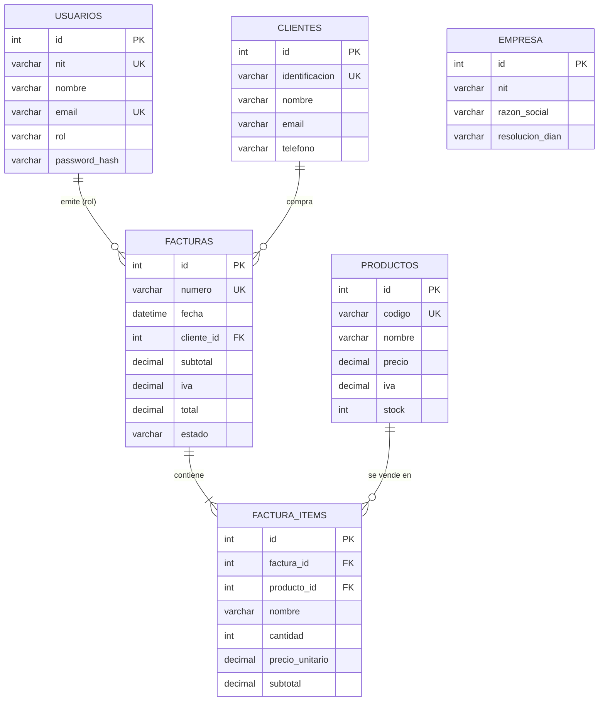

# FacturaExpress

FacturaExpress: sistema de facturacion electronica (Node.js + Express + MySQL).

---

## 1. Tecnologías y stack utilizado

| Componente           | Tecnología                                  |
| -------------------- | ------------------------------------------- |
| Entorno de ejecución | Node.js                                     |
| Framework de backend | Express.js                                  |
| Base de datos        | MySQL 8 (tablas relacionales)               |
| Driver de BD         | mysql2 (pool de conexiones)                 |
| Autenticación        | JSON Web Token (jsonwebtoken)               |
| Sesión segura        | Cookie httpOnly (cookie-parser)             |
| Cifrado de claves    | bcryptjs                                    |
| Cabeceras de seguridad | helmet                                    |
| Límite de peticiones | express-rate-limit                          |
| Validación de entrada| express-validator                           |
| Variables de entorno | dotenv                                      |
| CORS                 | cors (origen del frontend configurable)     |
| Control de versiones | Git + GitHub                                |

---

## 2. Estructura del proyecto

```
backend/
├── package.json              # Dependencias y scripts
├── .env.example              # Plantilla de variables de entorno
├── .env                      # Configuración local (no se sube a Git)
├── server.js                 # Punto de entrada de la API
├── config/
│   ├── db.js                 # Pool de conexiones MySQL
│   └── jwt.js                # Generación y verificación de tokens
├── controllers/
│   ├── auth.controller.js    # Inicio de sesión y usuario actual
│   ├── clientes.controller.js
│   ├── productos.controller.js
│   ├── facturas.controller.js # Ventas + facturación electrónica
│   ├── configuracion.controller.js
│   └── reportes.controller.js
├── routes/
│   ├── auth.routes.js
│   ├── clientes.routes.js
│   ├── productos.routes.js
│   ├── facturas.routes.js
│   ├── configuracion.routes.js
│   └── reportes.routes.js
├── middleware/
│   ├── auth.js               # JWT (cookie httpOnly o Bearer) + autorización por rol
│   ├── errorHandler.js       # 404, errores centrales, asyncHandler
│   ├── security.js           # Límites de peticiones (login y general)
│   └── validate.js           # Verificador central de validaciones (400)
├── validators/
│   └── index.js              # Reglas de validación por módulo
├── utils/
│   └── helpers.js            # Números de factura, IVA, mapeadores
├── db/
│   ├── schema.sql            # Creación de BD y tablas
│   └── seedData.js           # Datos por defecto (semejantes al frontend)
└── scripts/
    ├── setupDb.js            # Preparación en un paso (db:setup)
    └── seed.js               # Población de datos de ejemplo (db:seed)
```

---

## 3. Modelo de datos



| Tabla          | Descripción                                                              |
| -------------- | ------------------------------------------------------------------------ |
| `usuarios`     | Perfiles de acceso (admin, vendedor, contador) con contraseña cifrada.   |
| `clientes`     | Directorio de clientes (identificación, nombre, email, teléfono).        |
| `productos`    | Catálogo de productos (código, nombre, precio, IVA, stock).              |
| `facturas`     | Cabecera de factura con *snapshot* del cliente y totales calculados.     |
| `factura_items`| Líneas de cada factura (producto, cantidad, precio, IVA, subtotal).      |
| `empresa`      | Datos de la empresa emisora y configuración fiscal DIAN (un registro).   |

> **Nota sobre integridad:** al crear una factura se guarda una copia del nombre e
> identificación del cliente (denormalización). Así el histórico fiscal no cambia si
> el cliente se edita o elimina posteriormente. La eliminación de clientes/productos
> es **lógica** (campo `activo = 0`).

---

## 5. Usuarios de prueba (seed)

| Rol       | NIT            | Contraseña      |
| --------- | -------------- | --------------- |
| admin     | `900.123.456-7`| `admin123`      |
| vendedor  | `80.987.654-3` | `vendedor123`   |
| contador  | `70.555.444-2` | `contador123`   |

---

## 6. Buenas prácticas aplicadas

- **Nombres descriptivos** en rutas, controladores, variables y métodos.
- **Comentarios técnicos** en JSDoc explicando la función de cada módulo y controlador.
- **Separación de responsabilidades**: `routes` → `controllers` → `config`/`middleware`/`utils`.
- **Manejo centralizado de errores** con respuestas JSON consistentes (`success`/`message`).
- **Transacciones** para operaciones de escritura múltiple (factura + items + stock).
- **Validación de entrada** en el servidor (no se confía en los datos del cliente).
- **Seguridad**: contraseñas cifradas con `bcryptjs`, tokens JWT con expiración,
  cookie de sesión httpOnly, `Authorization` requerida en las rutas protegidas,
  CORS restringido al origen del frontend, validación de entrada, cabeceras de
  seguridad (helmet) y límite de peticiones.
- **Variables de entorno** para credenciales y configuración (`.env` excluido de Git).
- **Idempotencia del seed** y eliminación lógica para preservar el histórico fiscal.

---

## 7. Seguridad

Medidas implementadas para proteger la API:

| Medida | Detalle |
| ------ | ------- |
| **Cookie httpOnly** | El token JWT viaja en la cookie `token` con `HttpOnly` y `SameSite=Lax`, inmune a XSS (JavaScript no puede leerla). El frontend no almacena el token. |
| **Cookie `Secure`** | Con `NODE_ENV=production` la cookie solo viaja por HTTPS. |
| **Helmet** | Cabeceras HTTP de seguridad: CSP, `X-Frame-Options`, `X-Content-Type-Options`, HSTS, etc. (`server.js`). |
| **Límite de peticiones** | Login: 5 intentos/15 min por IP (`loginLimiter`). API general: 120 peticiones/min por IP (`apiLimiter`). Responden `429`. |
| **Validación de entrada** | `express-validator` (`validators/index.js`) valida tipos, formatos y rangos antes del controlador; responde `400` con la lista de campos (`middleware/validate.js`). |
| **Errores sin detalles** | En producción los errores `500` devuelven *"Error interno del servidor."*; el detalle (SQL, rutas) solo se registra en consola (`middleware/errorHandler.js`). |
| **Secreto JWT obligatorio** | Con `NODE_ENV=production` la API **no arranca** si falta `JWT_SECRET` (`config/jwt.js`), evitando tokens falsificables con un valor por defecto. |
| **Consultas parametrizadas** | `mysql2` con `?` en todos los queries (anti-SQL injection). |
| **Cifrado de contraseñas** | `bcryptjs` (nunca se guardan en texto plano). |
| **CORS restringido** | Solo el origen del frontend (`CORS_ORIGIN`) puede consumir la API con credenciales. |

> **Variables relevantes**: `NODE_ENV` (development/production), `JWT_SECRET`
> (obligatorio en producción), `JWT_EXPIRES_IN`, `CORS_ORIGIN`.

---

## 8. Registro de servicios web (resumen)

| # | Módulo         | Método | Ruta                                 | Función principal                          |
| - | -------------- | ------ | ------------------------------------ | ------------------------------------------ |
| 1 | Autenticación  | POST   | `/api/auth/login`                    | Iniciar sesión y emitir token JWT.         |
| 2 | Autenticación  | GET    | `/api/auth/me`                       | Consultar usuario autenticado.             |
| 3 | Clientes       | GET    | `/api/clientes`                      | Listar/buscar clientes.                    |
| 4 | Clientes       | GET    | `/api/clientes/:id`                  | Consultar un cliente.                      |
| 5 | Clientes       | POST   | `/api/clientes`                      | Registrar cliente.                         |
| 6 | Clientes       | PUT    | `/api/clientes/:id`                  | Actualizar cliente.                        |
| 7 | Clientes       | DELETE | `/api/clientes/:id`                  | Eliminar cliente.                          |
| 8 | Productos      | GET    | `/api/productos`                     | Listar/buscar productos.                   |
| 9 | Productos      | GET    | `/api/productos/:id`                 | Consultar un producto.                     |
| 10| Productos      | POST   | `/api/productos`                     | Registrar producto.                        |
| 11| Productos      | PUT    | `/api/productos/:id`                 | Actualizar producto.                       |
| 12| Productos      | PATCH  | `/api/productos/:id/stock`           | Ajustar stock.                             |
| 13| Productos      | DELETE | `/api/productos/:id`                 | Eliminar producto.                         |
| 14| Facturación    | GET    | `/api/facturas`                      | Listar facturas (filtros + búsqueda).      |
| 15| Facturación    | GET    | `/api/facturas/:id`                  | Consultar factura con items.               |
| 16| Facturación    | POST   | `/api/facturas`                      | Finalizar venta y generar factura.         |
| 17| Facturación    | PUT    | `/api/facturas/:id/estado`           | Actualizar estado DIAN.                    |
| 18| Facturación    | DELETE | `/api/facturas/:id`                  | Anular factura.                            |
| 19| Facturación    | GET    | `/api/facturas/:id/xml`              | Generar XML DIAN de la factura.            |
| 20| Facturación    | GET    | `/api/facturas/:id/csv`              | Generar CSV de la factura.                 |
| 21| Configuración  | GET    | `/api/configuracion`                 | Consultar empresa y configuración fiscal.  |
| 22| Configuración  | PUT    | `/api/configuracion/empresa`         | Actualizar datos de la empresa.            |
| 23| Configuración  | PUT    | `/api/configuracion/fiscal`          | Actualizar configuración fiscal DIAN.      |
| 24| Configuración  | POST   | `/api/configuracion/dian/sync`       | Sincronizar con la DIAN.                   |
| 25| Reportes       | GET    | `/api/reportes/kpis`                 | Indicadores clave del negocio.             |
| 26| Reportes       | GET    | `/api/reportes/ventas-semanales`     | Ventas de los últimos 7 días.              |
| 27| Reportes       | GET    | `/api/reportes/ventas-periodo`       | Ventas comparadas por periodo.             |
| 28| Reportes       | GET    | `/api/reportes/productos-top`        | Productos más vendidos.                    |
| 29| Reportes       | GET    | `/api/reportes/ultimas-transacciones`| Últimas facturas emitidas.                 |

---
