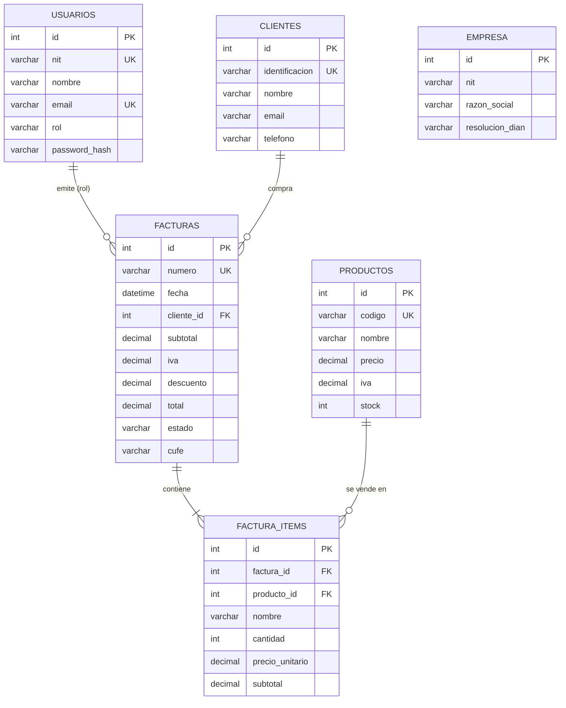

# FacturaExpress V3

Sistema de **facturación electrónica full-stack**: aplicación web **Angular 22** + API REST
**Node.js / Express** con base de datos **MySQL**, orientada a pequeñas y medianas empresas
colombianas (punto de venta, facturación con flujo DIAN, reportes y administración).

> Repositorio: <https://github.com/jhromero81/FacturaExpress_V3.git>

---

## 1. Tecnologías y stack utilizado

### Backend (API REST)

| Componente             | Tecnología                                  |
| ---------------------- | ------------------------------------------- |
| Entorno de ejecución   | Node.js                                     |
| Framework de backend   | Express.js                                  |
| Base de datos          | MySQL 8 (tablas relacionales)               |
| Driver de BD           | mysql2 (pool de conexiones)                 |
| Autenticación          | JSON Web Token (jsonwebtoken)               |
| Sesión segura          | Cookie httpOnly (cookie-parser)             |
| Cifrado de claves      | bcryptjs                                    |
| Cabeceras de seguridad | helmet                                      |
| Límite de peticiones   | express-rate-limit                          |
| Validación de entrada  | express-validator                           |
| Documentos             | pdfkit (PDF de facturas y reportes)         |
| Variables de entorno   | dotenv                                      |
| CORS                   | cors (origen del frontend configurable)     |
| Pruebas unitarias      | node --test                                 |
| Control de versiones   | Git + GitHub                                |

### Frontend (aplicación web)

| Componente            | Tecnología                                            |
| --------------------- | ----------------------------------------------------- |
| Framework             | Angular 22 (componentes standalone, sin NgModules)    |
| Lenguaje              | TypeScript (modo estricto)                            |
| Enrutado              | @angular/router con carga diferida (`loadComponent`)  |
| HTTP                  | HttpClient + interceptor funcional de sesión          |
| Estado reactivo       | Signals para estado local de componentes              |
| Estilos               | CSS global con variables (temas claro/oscuro/alto contraste) |
| Tipografías           | Roboto (texto) y Space Mono (números/código)          |
| Dev-server            | ng serve con proxy `/api` → `http://localhost:4000`   |

---

## 2. Estructura del proyecto

```
FacturaExpress_V3/
├── backend/                     # API REST Node.js + Express + MySQL
│   ├── package.json             # Dependencias y scripts
│   ├── .env.example             # Plantilla de variables de entorno
│   ├── Dockerfile               # Imagen Docker (Node 18 Alpine)
│   ├── server.js                # Punto de entrada de la API
│   ├── config/
│   │   ├── db.js                # Pool de conexiones MySQL
│   │   └── jwt.js               # Generación y verificación de tokens
│   ├── controllers/             # auth, clientes, productos, facturas,
│   │                            # configuracion, reportes, usuarios,
│   │                            # errores, logs, backup
│   ├── routes/                  # Un archivo de rutas por módulo
│   ├── middleware/
│   │   ├── auth.js              # JWT (cookie httpOnly o Bearer) + roles
│   │   ├── errorHandler.js      # 404, errores centrales, asyncHandler
│   │   ├── security.js          # Límites de peticiones (login y general)
│   │   └── validate.js          # Verificador central de validaciones (400)
│   ├── validators/index.js      # Reglas de validación por módulo
│   ├── services/                # backup.service.js, email.service.js,
│   │                            # pdf.service.js
│   ├── utils/                   # helpers.js, cune.js (hash SHA-256),
│   │                            # auditoria.js, errores.js
│   ├── db/
│   │   ├── schema.sql           # Creación de BD y tablas
│   │   └── seedData.js          # Datos iniciales para el seed
│   ├── scripts/                 # setupDb.js, migrate.js, seed.js
│   └── test/                    # 5 suites (40 pruebas unitarias)
├── frontend/                    # Aplicación web Angular 22
│   ├── proxy.conf.json          # /api → http://localhost:4000
│   ├── angular.json             # Configuración del workspace
│   └── src/
│       ├── styles.css           # Sistema de diseño (variables y temas)
│       ├── environments/        # environment.ts / environment.development.ts
│       └── app/
│           ├── app.config.ts    # Providers raíz (router, http, zona)
│           ├── app.routes.ts    # Rutas con carga diferida por módulo
│           ├── core/            # api.service, auth.service, guards,
│           │                    # interceptors.ts, render.service.ts
│           ├── features/
│           │   ├── layout/      # Shell: sidebar, topbar, router-outlet
│           │   └── …            # 12 módulos funcionales (ver sección 6)
│           └── shared/components/  # Modal, toasts, paginador, badges…
├── postman/
│   └── collections/             # Colección Postman v2.1 (56 peticiones)
├── docs/                        # Evidencias y documentación
└── README.md
```

---

## 3. Modelo de datos



La base de datos `facturaexpress_apirest` contiene 10 tablas:

| Tabla             | Descripción                                                              |
| ----------------- | ------------------------------------------------------------------------ |
| `usuarios`        | Perfiles de acceso (admin, vendedor, contador) con contraseña cifrada.   |
| `clientes`        | Directorio de clientes (identificación, nombre, email, teléfono).        |
| `productos`       | Catálogo de productos (código, nombre, precio, IVA, stock).              |
| `facturas`        | Cabecera de factura con *snapshot* del cliente, totales, CUNE y estado DIAN. |
| `factura_items`   | Líneas de cada factura (producto, cantidad, precio, IVA, subtotal).      |
| `empresa`         | Datos de la empresa emisora y configuración fiscal DIAN (un registro).   |
| `errores_sistema` | Registro de errores internos para monitoreo desde el módulo admin.       |
| `logs_auditoria`  | Bitácora de operaciones (usuario, acción, tabla, IP de origen).          |
| `reportes`        | Historial de reportes PDF generados.                                     |
| `backups`         | Metadatos de los respaldos SQL creados desde el módulo admin.            |

> **Nota sobre integridad:** al crear una factura se guarda una copia del nombre e
> identificación del cliente (denormalización). Así el histórico fiscal no cambia si
> el cliente se edita o elimina posteriormente. La eliminación de clientes/productos
> es **lógica** (campo `activo = 0`).

---

## 4. Análisis de endpoints

Todas las rutas (excepto `POST /api/auth/login`, `POST /api/auth/logout` y
`GET /api/health`) exigen autenticación; además, los módulos administrativos
(`usuarios`, `errores`, `logs`, `backup`) exigen rol **admin** (`authorize('admin')`).
La API acepta el token JWT de dos formas:

- **Cookie httpOnly `token`** (mecanismo principal, usado por el frontend):
  el navegador la envía automáticamente, sin que JavaScript la lea.
- **Encabezado `Authorization`** (para clientes externos / Postman):

```
Authorization: Bearer <token>
```

La estructura de respuesta es consistente:

```json
// Éxito
{ "success": true, "message": "…", "...datos": … }

// Error
{ "success": false, "message": "Descripción del error." }
```

### 4.1 Autenticación — `/api/auth`

| Método | Ruta               | Protegida | Descripción                                      |
| ------ | ------------------ | --------- | ------------------------------------------------ |
| POST   | `/api/auth/login`  | No        | Valida NIT y contraseña; emite cookie httpOnly y devuelve el token JWT y el usuario. |
| POST   | `/api/auth/logout` | No        | Cierra la sesión limpiando la cookie httpOnly.   |
| GET    | `/api/auth/me`     | Sí        | Datos del usuario autenticado con el token.      |

**`POST /api/auth/login`**

```json
// Body de entrada
{ "nit": "900.123.456-7", "password": "admin123" }

// Respuesta 200 OK (además fija la cookie httpOnly "token")
{
  "success": true,
  "message": "Inicio de sesion exitoso.",
  "token": "eyJhbGciOiJIUzI1NiIs...",
  "usuario": {
    "id": 1, "nit": "900.123.456-7", "nombre": "Jhon Henry Romero",
    "email": "admin@facturaexpress.co", "telefono": "+57 300 123 4567", "rol": "admin"
  }
}
```

| Código | Situación                         |
| ------ | --------------------------------- |
| 200    | Credenciales válidas.             |
| 401    | Credenciales incorrectas.         |
| 403    | Usuario inactivo.                 |
| 400    | Faltan campos obligatorios.       |
| 429    | Demasiados intentos (5 por IP cada 15 min). |

### 4.2 Clientes — `/api/clientes`

| Método | Ruta                | Protegida | Descripción                                      |
| ------ | ------------------- | --------- | ------------------------------------------------ |
| GET    | `/api/clientes`     | Sí        | Lista clientes con búsqueda y paginación.        |
| GET    | `/api/clientes/:id` | Sí        | Devuelve un cliente por id.                      |
| POST   | `/api/clientes`     | Sí        | Crea un cliente (valida duplicado de identificación). |
| PUT    | `/api/clientes/:id` | Sí        | Actualiza un cliente.                            |
| DELETE | `/api/clientes/:id` | Sí        | Elimina lógicamente un cliente.                  |

**Parámetros del GET de listado** (query string):

| Parámetro | Tipo   | Obligatorio | Descripción                              |
| --------- | ------ | ----------- | ---------------------------------------- |
| `q`       | string | No          | Texto de búsqueda por nombre, identificación o email. |
| `pagina`  | number | No          | Página de resultados (por defecto 1).    |
| `limite`  | number | No          | Registros por página (por defecto 50).   |

**Estructura JSON de un cliente:**

```json
{
  "id": 1,
  "identificacion": "80.123.456-1",
  "nombre": "Constructora Moderna S.A.S",
  "email": "compras@constructoramoderna.com",
  "telefono": "+57 310 234 5678"
}
```

**`POST /api/clientes` — cuerpo de entrada:** `{ identificacion, nombre, email?, telefono? }`

| Código | Situación                                                |
| ------ | -------------------------------------------------------- |
| 201    | Cliente creado.                                          |
| 400    | Faltan identificación o nombre.                          |
| 409    | Ya existe un cliente con esa identificación.             |
| 401    | Sin token o token inválido.                              |

### 4.3 Productos — `/api/productos`

| Método | Ruta                       | Protegida | Descripción                                     |
| ------ | -------------------------- | --------- | ----------------------------------------------- |
| GET    | `/api/productos`           | Sí        | Lista productos con búsqueda y paginación.      |
| GET    | `/api/productos/:id`       | Sí        | Devuelve un producto por id.                    |
| POST   | `/api/productos`           | Sí        | Crea un producto (valida duplicado de código).  |
| PUT    | `/api/productos/:id`       | Sí        | Actualiza un producto.                          |
| PATCH  | `/api/productos/:id/stock` | Sí        | Ajusta el stock sumando/restando unidades.      |
| DELETE | `/api/productos/:id`       | Sí        | Elimina lógicamente un producto.                |

**Estructura JSON de un producto:**

```json
{
  "id": 1, "codigo": "PROD001", "nombre": "Insumo Industrial X",
  "precio": 85000, "iva": 0.19, "stock": 50
}
```

**`PATCH /api/productos/:id/stock`** — cuerpo: `{ "cantidad": 10 }` (positivo suma, negativo resta).

| Código | Situación                                  |
| ------ | ------------------------------------------ |
| 201    | Producto creado.                           |
| 409    | Código de producto duplicado.              |
| 400    | Precio o cantidad inválidos.               |

### 4.4 Ventas y facturación — `/api/facturas`

| Método | Ruta                       | Protegida | Descripción                                      |
| ------ | -------------------------- | --------- | ------------------------------------------------ |
| GET    | `/api/facturas`            | Sí        | Lista facturas con filtros de estado y búsqueda. |
| GET    | `/api/facturas/:id`        | Sí        | Factura completa con sus items.                  |
| POST   | `/api/facturas`            | Sí        | **Finaliza una venta** y genera la factura electrónica. |
| PUT    | `/api/facturas/:id/estado` | Sí        | Actualiza el estado DIAN de una factura.         |
| DELETE | `/api/facturas/:id`        | Sí        | Anula una factura (estado `anulada`).            |
| GET    | `/api/facturas/:id/pdf`    | Sí        | Genera el PDF soporte de la factura.             |
| GET    | `/api/facturas/:id/xml`    | Sí        | Genera el XML de la factura (formato DIAN).      |
| GET    | `/api/facturas/:id/csv`    | Sí        | Genera el CSV con datos de la factura.           |

**`POST /api/facturas` — finalización de venta.** Lógica de negocio materializada:

1. Valida que el `clienteId` exista y esté activo.
2. Valida los items y sus cantidades contra el catálogo y el **stock disponible**.
3. Calcula **subtotal, descuento, IVA y total** del lado del servidor (no confía en el cliente).
4. Genera el número secuencial `FAC-YYYYMM-XXXXX`.
5. Genera el **CUNE** (hash SHA-256 determinista sobre los datos fiscales).
6. Inserta factura + items y **descuenta el stock** dentro de una **transacción atómica**; si algo falla, revierte todo.

```json
// Body de entrada
{
  "clienteId": 1,
  "items": [
    { "productoId": 1, "cantidad": 2 },
    { "productoId": 3, "cantidad": 1 }
  ],
  "descuento": 5000
}

// Respuesta 201 Created
{
  "success": true,
  "message": "Venta finalizada: FAC-202608-00001",
  "factura": {
    "id": 1, "numero": "FAC-202608-00001", "fecha": "2026-08-07T05:19:04.000Z",
    "cliente": { "id": 1, "identificacion": "80.123.456-1", "nombre": "Constructora Moderna S.A.S" },
    "subtotal": 420000, "iva": 79800, "descuento": 5000, "total": 494800,
    "estado": "enviado", "cufe": null,
    "items": [
      { "id": 1, "codigo": "PROD001", "nombre": "Insumo Industrial X", "cantidad": 2,
        "precioUnitario": 85000, "iva": 32300, "subtotal": 170000 },
      { "id": 3, "codigo": "PROD003", "nombre": "Material Premium Z", "cantidad": 1,
        "precioUnitario": 250000, "iva": 47500, "subtotal": 250000 }
    ]
  }
}
```

| Código | Situación                                              |
| ------ | ------------------------------------------------------ |
| 201    | Venta finalizada y factura generada.                   |
| 400    | Datos de entrada inválidos.                            |
| 404    | Cliente no encontrado.                                 |
| 409    | Stock insuficiente para algún producto.                |

**Estados DIAN válidos** (para el campo `estado`):

```
pendiente | enviado | enviada | procesando | rechazado | anulada
```

**`GET /api/facturas` — parámetros de filtrado:**

| Parámetro | Tipo   | Descripción                                    |
| --------- | ------ | ---------------------------------------------- |
| `estado`  | string | Filtra por estado DIAN (ej: `pendiente`).      |
| `q`       | string | Búsqueda por número de factura o cliente.      |
| `pagina`  | number | Página de resultados.                          |
| `limite`  | number | Registros por página (por defecto 20).         |

### 4.5 Configuración — `/api/configuracion`

| Método | Ruta                           | Protegida | Descripción                                  |
| ------ | ------------------------------ | --------- | -------------------------------------------- |
| GET    | `/api/configuracion`           | Sí        | Datos de la empresa y configuración fiscal.  |
| PUT    | `/api/configuracion/empresa`   | Sí        | Actualiza datos de la empresa.               |
| PUT    | `/api/configuracion/fiscal`    | Sí        | Actualiza resolución DIAN y vigencia del certificado. |
| POST   | `/api/configuracion/dian/sync` | Sí        | Simula sincronización con la DIAN.           |

### 4.6 Reportes — `/api/reportes`

| Método | Ruta                                           | Protegida | Descripción                                      |
| ------ | ---------------------------------------------- | --------- | ------------------------------------------------ |
| GET    | `/api/reportes/kpis`                           | Sí        | Indicadores: ventas del día, ticket promedio, pendientes DIAN, avance de meta, etc. |
| GET    | `/api/reportes/ventas-semanales`               | Sí        | Ventas por día de los últimos 7 días.            |
| GET    | `/api/reportes/ventas-periodo?periodo=mensual` | Sí        | Ventas agrupadas por periodo (semanal, mensual, trimestral, anual). |
| GET    | `/api/reportes/productos-top?limite=5`         | Sí        | Productos más vendidos.                          |
| GET    | `/api/reportes/ultimas-transacciones?limite=4` | Sí        | Últimas facturas emitidas.                       |
| GET    | `/api/reportes/pdf`                            | Sí        | Genera el reporte en PDF y lo persiste en el historial. |
| GET    | `/api/reportes/historial`                      | Sí        | Historial de reportes generados.                 |

**Respuesta de `GET /api/reportes/kpis`:**

```json
{
  "success": true,
  "kpis": {
    "ventasDia": 494800, "facturasEmitidasHoy": 1, "facturasEmitidas": 1,
    "pendientesDIAN": 0, "ticketPromedio": 494800, "ventasMes": 494800,
    "clientesNuevos": 5, "productosVendidos": 3,
    "metaVentasMensual": 6400000, "avanceMeta": 8
  }
}
```

### 4.7 Administración — solo rol admin

**Usuarios — `/api/usuarios`**

| Método | Ruta                     | Descripción                                       |
| ------ | ------------------------ | ------------------------------------------------- |
| GET    | `/api/usuarios`          | Lista cuentas del sistema.                        |
| GET    | `/api/usuarios/:id`      | Consulta un usuario.                              |
| POST   | `/api/usuarios`          | Crea usuario con rol (admin, vendedor, contador). |
| PUT    | `/api/usuarios/:id`      | Actualiza datos del usuario.                      |
| PATCH  | `/api/usuarios/:id/activo` | Activa/desactiva la cuenta.                     |
| DELETE | `/api/usuarios/:id`      | Elimina un usuario.                               |

**Errores del sistema — `/api/errores`**

| Método | Ruta                       | Descripción                                        |
| ------ | -------------------------- | -------------------------------------------------- |
| GET    | `/api/errores`             | Lista errores internos con filtros (tipo, resueltos). |
| PATCH  | `/api/errores/:id/resolver`| Marca un error como resuelto.                      |

**Auditoría — `/api/logs`**

| Método | Ruta          | Descripción                                             |
| ------ | ------------- | ------------------------------------------------------- |
| GET    | `/api/logs`   | Bitácora con filtros por usuario, tabla, acción e IP.   |

**Backups — `/api/backup`**

| Método | Ruta                             | Descripción                                    |
| ------ | -------------------------------- | ---------------------------------------------- |
| GET    | `/api/backup`                    | Lista los respaldos disponibles.               |
| POST   | `/api/backup`                    | Crea un respaldo SQL de la base de datos.      |
| POST   | `/api/backup/restaurar`          | Restaura la base desde un respaldo.            |
| GET    | `/api/backup/:archivo/download`  | Descarga el archivo `.sql`.                    |
| DELETE | `/api/backup/:archivo`           | Elimina un respaldo.                           |

---

## 5. Frontend Angular

Aplicación SPA standalone sin NgModules. El shell (`layout`) provee sidebar,
topbar y el `router-outlet`; cada módulo se carga de forma **diferida**
(`loadComponent`) generando chunks independientes en el build.

### Mapa de módulos (rutas)

| Ruta               | Módulo        | Funcionalidad principal                                  |
| ------------------ | ------------- | -------------------------------------------------------- |
| `/login`           | Login         | Inicio de sesión (acceso público).                       |
| `/dashboard`       | Dashboard     | KPIs, gráfico semanal y últimas transacciones.           |
| `/ventas`          | POS           | Punto de venta: carrito, descuento y finalización.       |
| `/facturas`        | Facturas      | Listado con filtros, paginación y descargas PDF/XML/CSV. |
| `/facturas/:id`    | Detalle       | Detalle, flujo DIAN (estado/firma/CUNE).                 |
| `/clientes`        | Clientes      | CRUD con búsqueda incremental.                           |
| `/productos`       | Productos     | CRUD, tarifas de IVA y ajuste de inventario.             |
| `/reportes`        | Reportes      | Comparativo por periodos, top productos, PDF e historial.|
| `/configuracion`   | Configuración | Empresa emisora, resolución DIAN y sincronización.       |
| `/usuarios`        | Admin         | Gestión de cuentas y roles (solo admin).                 |
| `/errores`         | Admin         | Monitoreo y marcado de errores internos (solo admin).    |
| `/auditoria`       | Admin         | Bitácora de operaciones (solo admin).                    |
| `/backup`          | Admin         | Respaldos: crear, descargar, restaurar, borrar (solo admin). |

Las rutas privadas están protegidas con `authGuard` y las administrativas
además con `adminGuard`; ambos consultan el estado de sesión de
`AuthService` (que restaura la sesión vía `GET /api/auth/me`).

### Renderizado reactivo

El interceptor HTTP notifica a `ServicioRender` (`core/render.service.ts`)
cuando llega cualquier respuesta; este servicio marca la vista activa
(`markForCheck`) y ejecuta un ciclo de detección de cambios, garantizando que
los datos se pinten inmediatamente sin requerir interacción del usuario.

### Sistema de diseño

Variables CSS en `styles.css` con tres temas seleccionables desde
Configuración (persistidos en localStorage):

| Tema           | Fondo app  | Tarjetas   | Texto      | Acento      |
| -------------- | ---------- | ---------- | ---------- | ----------- |
| Claro (raíz)   | `#f4f6f9`  | `#ffffff`  | `#1a2535`  | `#1abc9c`   |
| Oscuro         | `#121212`  | `#1e2a32`  | `#e0e0e0`  | `#ffeb3b`   |
| Alto contraste | `#ffffff`  | `#ffffff`  | `#000000`  | `#ffeb3b`   |

Colores semánticos: éxito `#27ae60`, advertencia `#f39c12`,
error `#e74c3c`, información `#3498db`.

---

## 6. Usuarios de prueba (seed)

| Rol       | NIT             | Contraseña     |
| --------- | --------------- | -------------- |
| admin     | `900.123.456-7` | `admin123`     |
| vendedor  | `80.987.654-3`  | `vendedor123`  |
| contador  | `70.555.444-2`  | `contador123`  |

---

## 7. Instalación y puesta en marcha

### Requisitos

- Node.js ≥ 20 (LTS recomendado)
- MySQL 8 corriendo localmente
- npm 10+ (el `package.json` del frontend declara `allowScripts` para esbuild/rollup)

### Paso 1 — Backend: variables de entorno

```bash
cd backend
cp .env.example .env
# Editar .env con las credenciales de MySQL locales
```

### Paso 2 — Backend: dependencias y base de datos

```bash
npm install
npm run db:setup        # crea BD, tablas (schema.sql) y datos iniciales
# Alternativa por pasos:
npm run db:migrate      # solo tablas
npm run db:seed         # solo datos de ejemplo
```

### Paso 3 — Iniciar la API

```bash
npm start        # Producción
npm run dev      # Desarrollo (nodemon, recarga automática)
```

La API queda disponible en `http://localhost:4000`
(verificar en `http://localhost:4000/api/health`).

### Paso 4 — Frontend

```bash
cd ../frontend
npm install
npm start               # http://localhost:4200 (proxy /api → 4000)
```

Abrir `http://localhost:4200` e iniciar sesión con el usuario demo.
El menú lateral muestra los módulos principales para todos los roles y la
sección de administración solo para el perfil admin.

### Paso 5 — Build de producción

```bash
cd frontend
npm run build
# → dist/facturaexpress-frontend/browser (paquete estático listo para publicar)
```

Para publicar el build, servir esa carpeta con cualquier servidor estático
que redirija `/api` al backend (mismo origen).

---

## 8. Pruebas con cURL

```bash
# 1. Iniciar sesión y guardar el token
TOKEN=$(curl -s -X POST http://localhost:4000/api/auth/login \
  -H "Content-Type: application/json" \
  -d '{"nit":"900.123.456-7","password":"admin123"}' \
  | node -pe "JSON.parse(require('fs').readFileSync(0)).token")

# 2. Listar clientes
curl -s http://localhost:4000/api/clientes -H "Authorization: Bearer $TOKEN"

# 3. Crear una venta / factura
curl -s -X POST http://localhost:4000/api/facturas \
  -H "Authorization: Bearer $TOKEN" -H "Content-Type: application/json" \
  -d '{"clienteId":1,"items":[{"productoId":1,"cantidad":2}]}'

# 4. Descargar el PDF y el XML de la factura 1
curl -s http://localhost:4000/api/facturas/1/pdf -H "Authorization: Bearer $TOKEN"
curl -s http://localhost:4000/api/facturas/1/xml -H "Authorization: Bearer $TOKEN"

# 5. Reportes
curl -s http://localhost:4000/api/reportes/kpis -H "Authorization: Bearer $TOKEN"
```

---

## 9. Pruebas de software

### 9.1 Unitarias (node --test)

```bash
cd backend && npm test
```

**40 pruebas unitarias OK** distribuidas en 5 suites:

| Suite                | Tests | Cubre                                                    |
| -------------------- | ----- | -------------------------------------------------------- |
| `cune.test.js`       | 6     | Hash CUNE SHA-256 determinista.                          |
| `helpers.test.js`    | 16    | Números de factura, formato moneda, cálculo de IVA.      |
| `jwt.test.js`        | 7     | Firma/verificación de tokens y expiración.               |
| `validate.test.js`   | 2     | Middleware central de validaciones (400).                |
| `validators.test.js` | 9     | Reglas de negocio por módulo (login, cliente, producto). |

### 9.2 Integración de la API (Postman / Newman)

Colección `postman/collections/FacturaExpress-API-Express.postman_collection.json`
(versión Postman v2.1) que cubre los **12 módulos** del backend:

```bash
npx newman run postman/collections/FacturaExpress-API-Express.postman_collection.json \
  --reporters cli
```

Resultado verificado: **56 peticiones ejecutadas, 91 aserciones evaluadas, 0 fallos**.

### 9.3 Verificación end-to-end (manual)

Flujo integral probado en navegador contra la API real: login → dashboard →
venta POS (con descuento y descuento atómico de stock) → detalle de factura →
descargas PDF/XML/CSV → cambio de estado DIAN → módulos admin → reportes.
Los totales calculados por el frontend coinciden con los del servidor.

---

## 10. Buenas prácticas aplicadas

### Backend

- **Nombres descriptivos** en rutas, controladores, variables y métodos.
- **Comentarios técnicos** en JSDoc explicando la función de cada módulo y controlador.
- **Separación de responsabilidades**: `routes` → `controllers` → `config`/`middleware`/`utils`.
- **Manejo centralizado de errores** con respuestas JSON consistentes (`success`/`message`).
- **Transacciones** para operaciones de escritura múltiple (factura + items + stock).
- **Validación de entrada** en el servidor (no se confía en los datos del cliente).
- **Idempotencia del seed** y eliminación lógica para preservar el histórico fiscal.

### Frontend

- **Componentes standalone** con sintaxis moderna de control de flujo (`@if`, `@for`).
- **Carga diferida por módulo** para optimizar el bundle inicial.
- **Guards de ruta** y redirección automática al login ante respuestas 401.
- **Interceptor HTTP central** que adjunta el token y normaliza errores.
- **Signals** para el estado local y toasts globales de notificación.
- **Renderizado garantizado tras cada respuesta HTTP** mediante `ServicioRender`.

---

## 11. Seguridad

Medidas implementadas para proteger la aplicación:

| Medida | Detalle |
| ------ | ------- |
| **Cookie httpOnly** | El token JWT viaja en la cookie `token` con `HttpOnly` y `SameSite=Lax`, inmune a XSS (JavaScript no puede leerla). |
| **Cookie `Secure`** | Con `NODE_ENV=production` la cookie solo viaja por HTTPS. |
| **Helmet** | Cabeceras HTTP de seguridad: CSP, `X-Frame-Options`, `X-Content-Type-Options`, HSTS, etc. (`server.js`). |
| **Límite de peticiones** | Login: 5 intentos/15 min por IP (`loginLimiter`). API general: 120 peticiones/min por IP (`apiLimiter`). Responden `429`. |
| **Validación de entrada** | `express-validator` valida tipos, formatos y rangos antes del controlador; responde `400` con la lista de campos (`middleware/validate.js`). |
| **Autorización por roles** | Middleware `authorize('admin')` en los módulos administrativos + `adminGuard` en las rutas del frontend. |
| **Errores sin detalles** | En producción los errores `500` devuelven *"Error interno del servidor."*; el detalle solo se registra en consola (`middleware/errorHandler.js`). |
| **Secreto JWT obligatorio** | Con `NODE_ENV=production` la API **no arranca** si falta `JWT_SECRET` (`config/jwt.js`). |
| **Consultas parametrizadas** | `mysql2` con `?` en todos los queries (anti-SQL injection). |
| **Cifrado de contraseñas** | `bcryptjs` (nunca se guardan en texto plano). |
| **CORS restringido** | Solo el origen configurado en `CORS_ORIGIN` puede consumir la API con credenciales. |

> **Variables relevantes**: `NODE_ENV` (development/production), `JWT_SECRET`
> (obligatorio en producción), `JWT_EXPIRES_IN`, `CORS_ORIGIN`.

---

## 12. Registro de servicios web (resumen)

| #  | Módulo         | Método | Ruta                                  | Función principal                          |
| -- | -------------- | ------ | ------------------------------------- | ------------------------------------------ |
| 0  | Salud          | GET    | `/api/health`                         | Verificar disponibilidad de la API.        |
| 1  | Autenticación  | POST   | `/api/auth/login`                     | Iniciar sesión y emitir token JWT.         |
| 2  | Autenticación  | POST   | `/api/auth/logout`                    | Cerrar sesión (limpia cookie).             |
| 3  | Autenticación  | GET    | `/api/auth/me`                        | Consultar usuario autenticado.             |
| 4  | Clientes       | GET    | `/api/clientes`                       | Listar/buscar clientes.                    |
| 5  | Clientes       | GET    | `/api/clientes/:id`                   | Consultar un cliente.                      |
| 6  | Clientes       | POST   | `/api/clientes`                       | Registrar cliente.                         |
| 7  | Clientes       | PUT    | `/api/clientes/:id`                   | Actualizar cliente.                        |
| 8  | Clientes       | DELETE | `/api/clientes/:id`                   | Eliminar cliente (lógico).                 |
| 9  | Productos      | GET    | `/api/productos`                      | Listar/buscar productos.                   |
| 10 | Productos      | GET    | `/api/productos/:id`                  | Consultar un producto.                     |
| 11 | Productos      | POST   | `/api/productos`                      | Registrar producto.                        |
| 12 | Productos      | PUT    | `/api/productos/:id`                  | Actualizar producto.                       |
| 13 | Productos      | PATCH  | `/api/productos/:id/stock`            | Ajustar stock.                             |
| 14 | Productos      | DELETE | `/api/productos/:id`                  | Eliminar producto (lógico).                |
| 15 | Facturación    | GET    | `/api/facturas`                       | Listar facturas (filtros + búsqueda).      |
| 16 | Facturación    | GET    | `/api/facturas/:id`                   | Consultar factura con items.               |
| 17 | Facturación    | POST   | `/api/facturas`                       | Finalizar venta y generar factura.         |
| 18 | Facturación    | PUT    | `/api/facturas/:id/estado`            | Actualizar estado DIAN.                    |
| 19 | Facturación    | DELETE | `/api/facturas/:id`                   | Anular factura.                            |
| 20 | Facturación    | GET    | `/api/facturas/:id/pdf`               | Generar PDF soporte de la factura.         |
| 21 | Facturación    | GET    | `/api/facturas/:id/xml`               | Generar XML DIAN de la factura.            |
| 22 | Facturación    | GET    | `/api/facturas/:id/csv`               | Generar CSV de la factura.                 |
| 23 | Configuración  | GET    | `/api/configuracion`                  | Consultar empresa y configuración fiscal.  |
| 24 | Configuración  | PUT    | `/api/configuracion/empresa`          | Actualizar datos de la empresa.            |
| 25 | Configuración  | PUT    | `/api/configuracion/fiscal`           | Actualizar configuración fiscal DIAN.      |
| 26 | Configuración  | POST   | `/api/configuracion/dian/sync`        | Sincronizar con la DIAN.                   |
| 27 | Reportes       | GET    | `/api/reportes/kpis`                  | Indicadores clave del negocio.             |
| 28 | Reportes       | GET    | `/api/reportes/ventas-semanales`      | Ventas de los últimos 7 días.              |
| 29 | Reportes       | GET    | `/api/reportes/ventas-periodo`        | Ventas comparadas por periodo.             |
| 30 | Reportes       | GET    | `/api/reportes/productos-top`         | Productos más vendidos.                    |
| 31 | Reportes       | GET    | `/api/reportes/ultimas-transacciones` | Últimas facturas emitidas.                 |
| 32 | Reportes       | GET    | `/api/reportes/pdf`                   | Exportar reporte PDF (persistido).         |
| 33 | Reportes       | GET    | `/api/reportes/historial`             | Historial de reportes generados.           |
| 34 | Usuarios*      | GET    | `/api/usuarios`                       | Listar cuentas del sistema.                |
| 35 | Usuarios*      | GET    | `/api/usuarios/:id`                   | Consultar un usuario.                      |
| 36 | Usuarios*      | POST   | `/api/usuarios`                       | Crear usuario con rol.                     |
| 37 | Usuarios*      | PUT    | `/api/usuarios/:id`                   | Actualizar usuario.                        |
| 38 | Usuarios*      | PATCH  | `/api/usuarios/:id/activo`            | Activar/desactivar cuenta.                 |
| 39 | Usuarios*      | DELETE | `/api/usuarios/:id`                   | Eliminar usuario.                          |
| 40 | Errores*       | GET    | `/api/errores`                        | Listar errores internos (filtros).         |
| 41 | Errores*       | PATCH  | `/api/errores/:id/resolver`           | Marcar error como resuelto.                |
| 42 | Auditoría*     | GET    | `/api/logs`                           | Bitácora de operaciones.                   |
| 43 | Backup*        | GET    | `/api/backup`                         | Listar respaldos.                          |
| 44 | Backup*        | POST   | `/api/backup`                         | Crear respaldo SQL.                        |
| 45 | Backup*        | POST   | `/api/backup/restaurar`               | Restaurar base de datos.                   |
| 46 | Backup*        | GET    | `/api/backup/:archivo/download`       | Descargar respaldo `.sql`.                 |
| 47 | Backup*        | DELETE | `/api/backup/:archivo`                | Eliminar respaldo.                         |

\* Endpoints exclusivos del rol **admin**.

---

## 13. Control de versiones (Git)

```bash
git clone https://github.com/jhromero81/FacturaExpress_V3.git
cd FacturaExpress_V3

# Flujo de trabajo
git checkout -b feature/mi-funcionalidad
git add .
git commit -m "feat: descripción corta de la funcionalidad"
git push origin feature/mi-funcionalidad
```

> Los archivos `backend/.env` y `frontend/node_modules` permanecen fuera del
> repositorio (incluidos en `.gitignore`).
