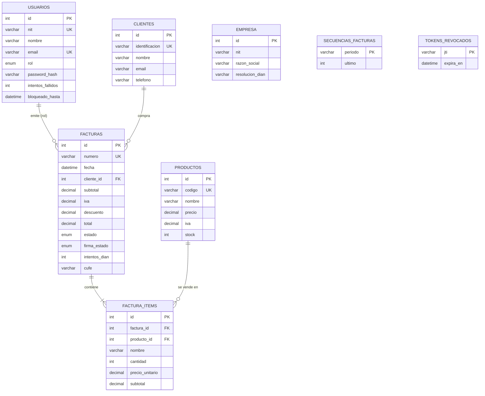

## 1. Tecnologías y stack utilizado

| Componente           | Tecnología                                  |
| -------------------- | ------------------------------------------- |
| Entorno de ejecución | Node.js                                     |
| Framework de backend | Express.js                                  |
| Base de datos        | MySQL 8 (tablas relacionales)               |
| Driver de BD         | mysql2 (pool de conexiones)                 |
| Autenticación        | JSON Web Token (jsonwebtoken)               |
| Sesión segura        | Cookie httpOnly (cookie-parser)             |
| Cifrado de claves    | bcryptjs                                    |
| Cabeceras de seguridad | helmet                                    |
| Límite de peticiones | express-rate-limit                          |
| Validación de entrada| express-validator                           |
| Documentos           | pdfkit (PDF de facturas y reportes)         |
| Correo               | nodemailer (envío de facturas)              |
| Variables de entorno | dotenv                                      |
| CORS                 | cors (origen del frontend configurable)     |
| Pruebas              | node --test (100 pruebas en 9 archivos)     |
| Control de versiones | Git + GitHub                                |

---

## 2. Estructura del proyecto

```
backend/
├── package.json              # Dependencias y scripts
├── .env.example              # Plantilla de variables de entorno
├── .env                      # Configuración local (no se sube a Git)
├── .dockerignore             # Excluye node_modules y .env de la imagen
├── Dockerfile                # Imagen de producción (Node 18 Alpine, usuario node)
├── server.js                 # Punto de entrada de la API
├── config/
│   ├── db.js                 # Pool de conexiones MySQL
│   ├── jwt.js                # Firma, verificación y revocación de tokens (issuer/audience)
│   └── password.js           # Política de contraseñas (mínimo 8, mayúscula, dígito)
├── controllers/
│   ├── auth.controller.js    # Inicio de sesión, bloqueo de cuenta y usuario actual
│   ├── clientes.controller.js
│   ├── productos.controller.js
│   ├── facturas.controller.js # Ventas + facturación electrónica
│   ├── configuracion.controller.js
│   ├── reportes.controller.js
│   ├── usuarios.controller.js
│   ├── errores.controller.js
│   ├── logs.controller.js
│   └── backup.controller.js
├── routes/
│   ├── auth.routes.js
│   ├── clientes.routes.js
│   ├── productos.routes.js
│   ├── facturas.routes.js
│   ├── configuracion.routes.js
│   ├── reportes.routes.js
│   ├── usuarios.routes.js
│   ├── errores.routes.js
│   ├── logs.routes.js
│   └── backup.routes.js
├── middleware/
│   ├── auth.js               # JWT (cookie httpOnly o Bearer) + autorización por rol
│   ├── errorHandler.js       # 404, errores centrales, asyncHandler
│   ├── security.js           # Límites de peticiones (login, anónimo y autenticado)
│   └── validate.js           # Verificador central de validaciones (400)
├── validators/
│   └── index.js              # Reglas de validación por módulo
├── utils/
│   ├── helpers.js            # Números de factura, IVA, mapeadores, escapes
│   ├── auditoria.js          # Registro de logs de auditoría (con IP real)
│   ├── cune.js               # Generación del hash CUFE (simulación DIAN)
│   └── errores.js            # Registro de errores del sistema
├── services/
│   ├── backup.service.js     # Respaldos, huella SHA-256 y restauración SQL
│   ├── email.service.js      # Envío de facturas por correo (nodemailer)
│   └── pdf.service.js        # Generación de PDF (PDFKit)
├── db/
│   ├── schema.sql            # Creación de BD y 12 tablas
│   └── seedData.js           # Datos por defecto (semejantes al frontend)
├── scripts/
│   ├── setupDb.js            # Preparación en un paso (db:setup)
│   ├── migrate.js            # Migraciones idempotentes (db:migrate)
│   ├── seed.js               # Población de datos de ejemplo (db:seed)
│   └── pruebas-aceptacion.js # Suite de aceptación E2E (21 casos, test:e2e)
└── test/
    ├── authorize.test.js     # Matriz de permisos por rol
    ├── backup.test.js        # Respaldos y verificación de huella
    ├── cune.test.js
    ├── helpers.test.js
    ├── jwt.test.js
    ├── login.test.js         # Login, bloqueo de cuenta, mensajes y contraseña no textual
    ├── validate.test.js
    ├── validators.test.js
    └── integracion/
        └── facturas.api.test.js
```

---

## 3. Modelo de datos



La base de datos `facturaexpress_apirest` contiene 12 tablas:

| Tabla                 | Descripción                                                              |
| --------------------- | ------------------------------------------------------------------------ |
| `usuarios`            | Perfiles de acceso (admin, vendedor, contador) con contraseña cifrada, contador de intentos fallidos y bloqueo temporal. |
| `clientes`            | Directorio de clientes (identificación, nombre, email, teléfono).        |
| `productos`           | Catálogo de productos (código, nombre, precio, IVA, stock).              |
| `facturas`            | Cabecera de factura con *snapshot* del cliente, totales, CUFE, estado DIAN y estado de firma. |
| `factura_items`       | Líneas de cada factura (producto, cantidad, precio, IVA, subtotal).      |
| `empresa`             | Datos de la empresa emisora y configuración fiscal DIAN (un registro).   |
| `errores_sistema`     | Registro de errores internos para monitoreo desde el módulo admin.       |
| `logs_auditoria`      | Bitácora de operaciones (usuario, acción, tabla, IP de origen).          |
| `reportes`            | Historial de reportes PDF generados.                                     |
| `backups`             | Metadatos de los respaldos SQL (archivo único y huella SHA-256).         |
| `secuencias_facturas` | Consecutivo por periodo (`YYYYMM`) usado para numerar las facturas.      |
| `tokens_revocados`    | Identificadores `jti` de los JWT cerrados antes de su expiración.        |

> **Nota sobre integridad:** al crear una factura se guarda una copia del nombre e
> identificación del cliente (denormalización). Así el histórico fiscal no cambia si
> el cliente se edita o elimina posteriormente. La eliminación de clientes/productos
> es **lógica** (campo `activo = 0`). El esquema declara `rol`, `estado` y
> `firma_estado` como `ENUM`, un `CHECK (stock >= 0)`, `UNIQUE` sobre
> `backups.archivo`, charset `utf8mb4` explícito por tabla e índices nuevos
> (`reportes.created_at`, `tokens_revocados.expira_en`, entre otros).

---

## 4. Análisis de endpoints

Todas las rutas (excepto `POST /api/auth/login`, `POST /api/auth/logout` y
`GET /api/health`) exigen autenticación. Cada operación de escritura aplica además
la **matriz de permisos por rol** (sección 4.7). La API acepta el token JWT de dos formas:

- **Cookie httpOnly `token`** (mecanismo principal, usado por el frontend):
  el navegador la envía automáticamente, sin que JavaScript la lea.
- **Encabezado `Authorization`** (para clientes externos / Postman):

```
Authorization: Bearer <token>
```

La estructura de respuesta es consistente:

```json
// Éxito
{ "success": true, "message": "…", "...datos": … }

// Error
{ "success": false, "message": "Descripción del error." }
```

### 4.1 Autenticación — `/api/auth`

| Método | Ruta            | Protegida | Descripción                                      |
| ------ | --------------- | --------- | ------------------------------------------------ |
| POST   | `/api/auth/login` | No      | Valida NIT y contraseña; emite cookie httpOnly y devuelve el token JWT y el usuario. |
| POST   | `/api/auth/logout` | No     | Cierra la sesión limpiando la cookie httpOnly.   |
| GET    | `/api/auth/me`  | Sí        | Datos del usuario autenticado con el token.      |

**`POST /api/auth/login`**

```json
// Body de entrada (la contrasena se define en SEED_ADMIN_PASSWORD o la imprime el seed)
{ "nit": "900.123.456-7", "password": "<contrasena del seed>" }

// Respuesta 200 OK (ademas fija la cookie httpOnly "token")
// El campo "token" solo viaja si el cliente envia el encabezado X-Token-Response: true
{
  "success": true,
  "message": "Inicio de sesion exitoso.",
  "token": "eyJhbGciOiJIUzI1NiIs...",
  "usuario": {
    "id": 1, "nit": "900.123.456-7", "nombre": "Jhon Henry Romero",
    "email": "admin@facturaexpress.co", "telefono": "+57 300 123 4567", "rol": "admin"
  }
}
```

> El token viaja en la cookie httpOnly; solo se incluye en el cuerpo si el cliente
> envía `X-Token-Response: true`. El bloqueo temporal y el mensaje único de
> credenciales evitan enumerar usuarios.

| Código | Situación                         |
| ------ | --------------------------------- |
| 200    | Credenciales válidas.             |
| 400    | Faltan campos obligatorios.       |
| 401    | Credenciales incorrectas, cuenta inactiva o eliminada (mensaje único). |
| 423    | Cuenta bloqueada temporalmente tras 5 intentos fallidos (15 min). |
| 429    | Demasiados intentos (5 por IP cada 15 min). |

> Una contraseña con un tipo no textual (por ejemplo un número) responde `401`, no
> `500`: el controlador valida el tipo antes de llamar a `bcrypt.compare`.

### 4.2 Clientes — `/api/clientes`

| Método | Ruta             | Protegida | Descripción                                      |
| ------ | ---------------- | --------- | ------------------------------------------------ |
| GET    | `/api/clientes`  | Sí        | Lista clientes con búsqueda y paginación.        |
| GET    | `/api/clientes/:id` | Sí     | Devuelve un cliente por id.                      |
| POST   | `/api/clientes`  | Sí        | Crea un cliente (valida duplicado de identificación). **Admin y vendedor.** |
| PUT    | `/api/clientes/:id` | Sí     | Actualiza un cliente. **Admin y vendedor.**       |
| DELETE | `/api/clientes/:id` | Sí     | Elimina lógicamente un cliente. **Solo admin.**   |

**Parámetros del GET de listado** (query string):

| Parámetro | Tipo   | Obligatorio | Descripción                              |
| --------- | ------ | ----------- | ---------------------------------------- |
| `q`       | string | No          | Texto de búsqueda por nombre, identificación o email. |
| `pagina`  | number | No          | Página de resultados (por defecto 1).    |
| `limite`  | number | No          | Registros por página (por defecto 50).   |

**Estructura JSON de un cliente:**

```json
{
  "id": 1,
  "identificacion": "80.123.456-1",
  "nombre": "Constructora Moderna S.A.S",
  "email": "compras@constructoramoderna.com",
  "telefono": "+57 310 234 5678"
}
```

**`POST /api/clientes` — cuerpo de entrada:** `{ identificacion, nombre, email?, telefono? }`

| Código | Situación                                                |
| ------ | -------------------------------------------------------- |
| 201    | Cliente creado.                                          |
| 400    | Faltan identificación o nombre.                          |
| 409    | Ya existe un cliente con esa identificación.             |
| 401    | Sin token o token inválido.                              |
| 403    | El rol autenticado no tiene permiso para la operación.   |

### 4.3 Productos — `/api/productos`

| Método | Ruta                       | Protegida | Descripción                                     |
| ------ | -------------------------- | --------- | ----------------------------------------------- |
| GET    | `/api/productos`           | Sí        | Lista productos con búsqueda y paginación.      |
| GET    | `/api/productos/:id`       | Sí        | Devuelve un producto por id.                    |
| POST   | `/api/productos`           | Sí        | Crea un producto (valida duplicado de código). **Solo admin.** |
| PUT    | `/api/productos/:id`       | Sí        | Actualiza un producto. **Solo admin.**          |
| PATCH  | `/api/productos/:id/stock` | Sí        | Ajusta el stock sumando/restando unidades. **Solo admin.** |
| DELETE | `/api/productos/:id`       | Sí        | Elimina lógicamente un producto. **Solo admin.** |

**Estructura JSON de un producto:**

```json
{
  "id": 1, "codigo": "PROD001", "nombre": "Insumo Industrial X",
  "precio": 85000, "iva": 0.19, "stock": 50
}
```

**`PATCH /api/productos/:id/stock`** — cuerpo: `{ "cantidad": 10 }` (positivo suma, negativo resta).

| Código | Situación                                  |
| ------ | ------------------------------------------ |
| 201    | Producto creado.                           |
| 409    | Código de producto duplicado.              |
| 400    | Precio o cantidad inválidos.               |

### 4.4 Ventas y facturación — `/api/facturas`

| Método | Ruta                   | Protegida | Descripción                                      |
| ------ | ---------------------- | --------- | ------------------------------------------------ |
| GET    | `/api/facturas`        | Sí        | Lista facturas con filtros de estado y búsqueda. |
| GET    | `/api/facturas/:id`    | Sí        | Factura completa con sus items.                  |
| POST   | `/api/facturas`        | Sí        | **Finaliza una venta** y genera la factura electrónica. **Admin y vendedor.** |
| PUT    | `/api/facturas/:id/estado` | Sí    | Actualiza el estado DIAN de una factura. **Admin y contador.** |
| DELETE | `/api/facturas/:id`    | Sí        | Elimina físicamente una factura pendiente (**restituye el stock**). **Solo admin.** |
| GET    | `/api/facturas/:id/pdf` | Sí       | Genera el PDF soporte de la factura.             |
| GET    | `/api/facturas/:id/xml` | Sí       | Genera el XML de la factura (formato DIAN).      |
| GET    | `/api/facturas/:id/csv` | Sí       | Genera el CSV con datos de la factura.           |

Una factura ya `enviada` no se puede eliminar (responde `409`).

**`POST /api/facturas` — finalización de venta.** Lógica de negocio materializada:

1. Valida que el `clienteId` exista y esté activo.
2. Valida los items y sus cantidades contra el catálogo y el **stock disponible**.
3. Calcula **subtotal, descuento, IVA y total** del lado del servidor (no confía en el cliente).
   El IVA usa la tarifa configurada en **cada producto** (0, 0.05 o 0.19), no una
   constante del 19 %. La suma del IVA de las líneas coincide con el IVA de la
   cabecera aunque exista descuento.
4. Genera el número secuencial `FAC-YYYYMM-XXXXX` leyendo y actualizando la tabla
   `secuencias_facturas` (`INSERT ... ON DUPLICATE KEY UPDATE`). Antes se deducía con
   `COUNT(*) + 1`, de modo que eliminar una factura rompía la numeración del mes
   (clave duplicada) y podía reutilizar números fiscales.
5. Genera el **CUFE** (hash SHA-256 determinista sobre los datos fiscales).
6. Inserta factura + items y **descuenta el stock** dentro de una **transacción atómica**; si algo falla, revierte todo.

```json
// Body de entrada
{
  "clienteId": 1,
  "items": [
    { "productoId": 1, "cantidad": 2 },
    { "productoId": 3, "cantidad": 1 }
  ],
  "descuento": 5000
}

// Respuesta 201 Created
{
  "success": true,
  "message": "Venta finalizada: FAC-202608-00001",
  "factura": {
    "id": 1, "numero": "FAC-202608-00001", "fecha": "2026-08-07T05:19:04.000Z",
    "cliente": { "id": 1, "identificacion": "80.123.456-1", "nombre": "Constructora Moderna S.A.S" },
    "subtotal": 420000, "iva": 79800, "descuento": 5000, "total": 494800,
    "estado": "pendiente", "cufe": null,
    "items": [
      { "id": 1, "codigo": "PROD001", "nombre": "Insumo Industrial X", "cantidad": 2,
        "precioUnitario": 85000, "iva": 32300, "subtotal": 170000 },
      { "id": 3, "codigo": "PROD003", "nombre": "Material Premium Z", "cantidad": 1,
        "precioUnitario": 250000, "iva": 47500, "subtotal": 250000 }
    ]
  }
}
```

| Código | Situación                                              |
| ------ | ------------------------------------------------------ |
| 201    | Venta finalizada y factura generada.                   |
| 400    | Datos de entrada inválidos.                            |
| 403    | El rol autenticado no puede emitir facturas.           |
| 404    | Cliente no encontrado.                                 |
| 409    | Stock insuficiente para algún producto.                |

**Estados DIAN válidos** (para el campo `estado`):

```
pendiente | enviada | rechazada
```

`PUT /api/facturas/:id/estado` acepta los tres estados: los valores `pendiente` y
`rechazada` antes devolvían `500` porque `intentos_dian` se enviaba como `NULL`; ahora
funcionan y `intentos_dian` se **acumula** en cada envío (antes se sobrescribía con 1).
El estado de firma se guarda en `firma_estado` (`pendiente | firmada | rechazada`).

**`GET /api/facturas` — parámetros de filtrado:**

| Parámetro | Tipo   | Descripción                                    |
| --------- | ------ | ---------------------------------------------- |
| `estado`  | string | Filtra por estado DIAN (ej: `pendiente`).      |
| `q`       | string | Búsqueda por número de factura o cliente.      |
| `pagina`  | number | Página de resultados.                          |
| `limite`  | number | Registros por página (por defecto 20).         |

### 4.5 Configuración — `/api/configuracion`

| Método | Ruta                        | Protegida | Descripción                                  |
| ------ | --------------------------- | --------- | -------------------------------------------- |
| GET    | `/api/configuracion`        | Sí        | Datos de la empresa y configuración fiscal.  |
| PUT    | `/api/configuracion/empresa`| Sí        | Actualiza datos de la empresa. **Solo admin.** |
| PUT    | `/api/configuracion/fiscal` | Sí        | Actualiza resolución DIAN y vigencia del certificado. **Solo admin.** |
| POST   | `/api/configuracion/dian/sync` | Sí    | Simula sincronización con la DIAN. **Solo admin.** |

### 4.6 Reportes — `/api/reportes`

| Método | Ruta                                  | Protegida | Descripción                                      |
| ------ | ------------------------------------- | --------- | ------------------------------------------------ |
| GET    | `/api/reportes/kpis`                  | Sí        | Indicadores: ventas del día, ticket promedio, pendientes DIAN, avance de meta, etc. |
| GET    | `/api/reportes/ventas-semanales`      | Sí        | Ventas por día de los últimos 7 días.            |
| GET    | `/api/reportes/ventas-periodo?periodo=mensual` | Sí | Ventas agrupadas por periodo (semanal, mensual, trimestral, anual). |
| GET    | `/api/reportes/productos-top?limite=5` | Sí       | Productos más vendidos.                          |
| GET    | `/api/reportes/ultimas-transacciones?limite=4` | Sí | Últimas facturas emitidas.                       |
| GET    | `/api/reportes/pdf`                   | Sí        | Genera el reporte en PDF y lo persiste en el historial. |
| GET    | `/api/reportes/historial`             | Sí        | Historial de reportes generados.                 |

Reportes y dashboard están disponibles para **todos los roles**.

**Respuesta de `GET /api/reportes/kpis`:**

```json
{
  "success": true,
  "kpis": {
    "ventasDia": 494800, "facturasEmitidasHoy": 1, "ventasAyer": 0,
    "facturasEmitidas": 1, "pendientesDIAN": 0, "ticketPromedio": 494800,
    "ventasMes": 494800, "clientesNuevos": 5, "productosVendidos": 3,
    "metaVentasMensual": 6400000, "avanceMeta": 8
  }
}
```

`ventasMes` y `facturasEmitidas` se calculan sobre **el mes en curso** (antes eran el
acumulado histórico) y se agregó `ventasAyer` para la tendencia. Las fechas se
comparan dentro de MySQL con `CURDATE()` para evitar desfases de zona horaria.

### 4.7 Matriz de permisos por rol

| Recurso / operación                        | admin | vendedor | contador |
| ------------------------------------------ | :---: | :------: | :------: |
| Clientes — lectura                         |  Sí   |    Sí    |    Sí    |
| Clientes — alta y edición                  |  Sí   |    Sí    |    No    |
| Clientes — eliminación                     |  Sí   |    No    |    No    |
| Productos — lectura                        |  Sí   |    Sí    |    Sí    |
| Productos — alta, edición, stock y baja    |  Sí   |    No    |    No    |
| Facturas — consulta y descargas            |  Sí   |    Sí    |    Sí    |
| Facturas — emisión                         |  Sí   |    Sí    |    No    |
| Facturas — cambio de estado DIAN           |  Sí   |    No    |    Sí    |
| Facturas — eliminación                     |  Sí   |    No    |    No    |
| Reportes y dashboard — lectura             |  Sí   |    Sí    |    Sí    |
| Configuración — escritura                  |  Sí   |    No    |    No    |
| Usuarios, errores, logs y respaldos        |  Sí   |    No    |    No    |

La matriz se implementa con el middleware `authorize(...)` declarado en cada
archivo de `routes/`.

---

## 5. Usuarios de prueba (seed)

El seed crea tres cuentas. **No existen contraseñas por defecto conocidas**: la
contraseña se toma de la variable `SEED_*_PASSWORD` correspondiente o, si no está
definida, el seed **genera una contraseña aleatoria y la muestra una sola vez** por
consola. La política exige mínimo 8 caracteres con minúscula, mayúscula y dígito.

| Rol       | NIT            | Nombre               | Email                        | Contraseña |
| --------- | -------------- | -------------------- | ---------------------------- | ---------- |
| admin     | `900.123.456-7`| Jhon Henry Romero    | `admin@facturaexpress.co`    | `SEED_ADMIN_PASSWORD` o la generada por el seed |
| vendedor  | `80.987.654-3` | Maria Fernanda Lopez | `vendedor@facturaexpress.co` | `SEED_VENDEDOR_PASSWORD` o la generada por el seed |
| contador  | `70.555.444-2` | Carlos Andres Ruiz   | `contador@facturaexpress.co` | `SEED_CONTADOR_PASSWORD` o la generada por el seed |

---

## 6. Instalación y puesta en marcha

> **Monorepositorio:** estos pasos son solo para trabajar directamente dentro
> de `backend/`. Desde la raíz del repositorio puede usar los scripts
> orquestados: `npm run setup` (primera vez) y `npm run dev` (levanta API y
> frontend juntos). Ver el README raíz, sección 7.

### Requisitos
- Node.js ≥ 20 (la CI usa Node 20 para el backend y Node 22 para el frontend)
- MySQL 8 corriendo localmente

### Paso 1 — Configurar variables de entorno

```bash
cd backend
cp .env.example .env
# Editar .env con las credenciales de MySQL locales
```

Variables principales de `backend/.env.example`:

| Variable | Uso | Valor por defecto |
| -------- | --- | ----------------- |
| `NODE_ENV` | `development` / `production`. | `development` |
| `PORT` | Puerto de la API. | `4000` |
| `DB_HOST` / `DB_PORT` / `DB_NAME` / `DB_USER` / `DB_PASSWORD` | Conexión a MySQL. | `localhost` / `3306` / `facturaexpress_apirest` / `root` / — |
| `DB_RESTORE_USER` / `DB_RESTORE_PASSWORD` | Credenciales con privilegios DDL usadas **solo al restaurar respaldos**; si quedan vacías se reutilizan las de runtime. | vacías |
| `BACKUP_DIR` | Directorio de respaldos; se crea con permisos `0700` y los volcados con `0600`. | `<tmp>/facturaexpress_backups` |
| `JWT_SECRET` | **Obligatorio en producción**: mínimo 32 caracteres y distinto del valor de ejemplo (la API se niega a arrancar). | — |
| `JWT_EXPIRES_IN` | Vigencia del token. | `8h` |
| `JWT_ISSUER` / `JWT_AUDIENCE` | Emisor y audiencia que se firman y se exigen al verificar el token. | `facturaexpress-api` / `facturaexpress-web` |
| `CORS_ORIGIN` | Origen(es) autorizados; admite varios separados por coma. | `http://localhost:4200` |
| `TRUST_PROXY` | Saltos de proxy inverso en los que confiar. | `loopback` |
| `MAIL_HOST` / `MAIL_PORT` / `MAIL_USERNAME` / `MAIL_PASSWORD` | Envío de facturas por correo (opcional). | — |
| `SEED_ADMIN_PASSWORD` / `SEED_VENDEDOR_PASSWORD` / `SEED_CONTADOR_PASSWORD` | Contraseñas de los usuarios del seed; si no se definen, el seed las genera y las muestra una sola vez. | aleatorias |
| `E2E_BASE_URL` / `E2E_NIT` / `E2E_PASSWORD` / `E2E_VENDEDOR_NIT` / `E2E_VENDEDOR_PASSWORD` | Credenciales de la suite de aceptación; `E2E_PASSWORD` y `E2E_VENDEDOR_PASSWORD` son obligatorias. | `E2E_NIT=900.123.456-7`, `E2E_VENDEDOR_NIT=80.987.654-3` |

Generar un secreto válido:

```bash
node -e "console.log(require('crypto').randomBytes(48).toString('hex'))"
```

En desarrollo, si `JWT_SECRET` no está definido la API genera uno aleatorio por
proceso (las sesiones se invalidan al reiniciar).

### Paso 2 — Instalar dependencias

```bash
npm install
```

### Paso 3 — Crear base de datos, tablas y datos de ejemplo

```bash
npm run db:setup
```

> El script ejecuta `db/schema.sql` (crea la BD `facturaexpress_apirest` y sus 12 tablas)
> y luego puebla empresa, usuarios, clientes y productos. Si no se definen las
> variables `SEED_*_PASSWORD`, revise la consola para copiar las contraseñas generadas.

### Paso 4 — Iniciar la API

```bash
npm start        # Producción (exige JWT_SECRET válido)
npm run dev      # Desarrollo (nodemon, recarga automática)
```

La API queda disponible en `http://localhost:4000` (verificar en `http://localhost:4000/api/health`).

### Pruebas

```bash
npm test                 # 100 pruebas (74 unitarias + 26 de integración)
npm run test:unit        # solo unitarias
npm run test:integracion # solo integración
npm run test:e2e         # 21 casos de aceptación (requiere API + MySQL y E2E_PASSWORD)
```

---

## 7. Pruebas con cURL

```bash
# 1. Iniciar sesion y guardar el token
#    X-Token-Response: true es obligatorio para recibir el token en el cuerpo;
#    de lo contrario solo viaja en la cookie httpOnly.
ADMIN_PASSWORD='<contrasena del seed>'
TOKEN=$(curl -s -X POST http://localhost:4000/api/auth/login \
  -H "Content-Type: application/json" \
  -H "X-Token-Response: true" \
  -d "{\"nit\":\"900.123.456-7\",\"password\":\"$ADMIN_PASSWORD\"}" \
  | node -pe "JSON.parse(require('fs').readFileSync(0)).token")

# 2. Listar clientes
curl -s http://localhost:4000/api/clientes -H "Authorization: Bearer $TOKEN"

# 3. Crear una venta / factura
curl -s -X POST http://localhost:4000/api/facturas \
  -H "Authorization: Bearer $TOKEN" -H "Content-Type: application/json" \
  -d '{"clienteId":1,"items":[{"productoId":1,"cantidad":2}]}'

# 4. Descargar el PDF y el XML de la factura 1
curl -s http://localhost:4000/api/facturas/1/pdf -H "Authorization: Bearer $TOKEN"
curl -s http://localhost:4000/api/facturas/1/xml -H "Authorization: Bearer $TOKEN"

# 5. Reportes
curl -s http://localhost:4000/api/reportes/kpis -H "Authorization: Bearer $TOKEN"
```

---

## 8. Buenas prácticas aplicadas

- **Nombres descriptivos** en rutas, controladores, variables y métodos.
- **Comentarios técnicos** en JSDoc explicando la función de cada módulo y controlador.
- **Separación de responsabilidades**: `routes` → `controllers` → `config`/`middleware`/`utils`.
- **Manejo centralizado de errores** con respuestas JSON consistentes (`success`/`message`).
- **Transacciones** para operaciones de escritura múltiple (factura + items + stock).
- **Validación de entrada** en el servidor (no se confía en los datos del cliente).
- **Integridad en la base**: `ENUM`, `CHECK (stock >= 0)`, `UNIQUE` e índices declarados en `schema.sql`.
- **Consecutivo fiscal seguro** en `secuencias_facturas` (no se reutilizan números).
- **Seguridad**: contraseñas cifradas con `bcryptjs`, tokens JWT con expiración,
  emisor y audiencia verificados, cookie de sesión httpOnly, `Authorization` requerida
  en las rutas protegidas, CORS restringido a los orígenes del frontend, validación de
  entrada, cabeceras de seguridad (helmet) y límite de peticiones que verifica la firma
  del token.
- **Variables de entorno** para credenciales y configuración (`.env` excluido de Git).
- **Idempotencia del seed** y eliminación lógica para preservar el histórico fiscal.

---

## 9. Seguridad

Medidas implementadas para proteger la API:

| Medida | Detalle |
| ------ | ------- |
| **Cookie httpOnly** | El token JWT viaja en la cookie `token` con `HttpOnly` y `SameSite=Lax`, inmune a XSS (JavaScript no puede leerla). El frontend no almacena el token y el cuerpo de la respuesta solo lo incluye si se envía `X-Token-Response: true`. |
| **Cookie `Secure`** | Con `NODE_ENV=production` la cookie solo viaja por HTTPS. |
| **Helmet** | Cabeceras HTTP de seguridad: `X-Frame-Options`, `X-Content-Type-Options`, HSTS, etc. (`server.js`). |
| **Límite de peticiones** | Login: 5 intentos/15 min por IP (`loginLimiter`). API anónima: 120 peticiones/min por IP (`apiLimiter`). Autenticados: 600/min (`apiAuthLimiter`). Para elegir el cupo se verifica la **firma** del JWT: un encabezado `Bearer x` inventado ya no evade el límite anónimo. Responden `429`. |
| **Bloqueo de cuenta** | Tras 5 intentos fallidos la cuenta se bloquea 15 minutos (`423`); los intentos se reinician al iniciar sesión correctamente. |
| **Validación de entrada** | `express-validator` (`validators/index.js`) valida tipos, formatos y rangos antes del controlador; responde `400` con la lista de campos (`middleware/validate.js`). |
| **Autorización por roles** | `authorize(...)` en cada ruta según la matriz documentada en la sección 4.7. |
| **Errores sin detalles** | En producción los errores `500` devuelven *"Error interno del servidor."*; el detalle (SQL, rutas) solo se registra en consola (`middleware/errorHandler.js`). |
| **Secreto JWT obligatorio** | Con `NODE_ENV=production` la API **no arranca** si falta `JWT_SECRET`, mide menos de 32 caracteres o conserva el valor de ejemplo (`config/jwt.js`). En desarrollo se genera uno aleatorio por proceso si no está definido. |
| **Emisor y audiencia** | El token se firma con `JWT_ISSUER`/`JWT_AUDIENCE` y ambos se exigen al verificar. |
| **Revocación de sesiones** | Cada token lleva un `jti`; el logout lo registra en `tokens_revocados` y el middleware lo rechaza aunque el JWT siga vigente. La restauración de un respaldo vacía esa tabla para forzar un nuevo inicio de sesión. |
| **Respaldos protegidos** | Directorio `0700`, volcados `0600`; cada respaldo guarda su huella SHA-256 en la tabla `backups` y la restauración la verifica (rechaza archivos alterados). Solo se restauran respaldos registrados. |
| **Consultas parametrizadas** | `mysql2` con `?` en todos los queries (anti-SQL injection). |
| **Cifrado de contraseñas** | `bcryptjs` con coste 12 (nunca se guardan en texto plano) y política única de contraseñas en `config/password.js`. |
| **CORS restringido** | Solo los orígenes de `CORS_ORIGIN` (varios separados por coma) pueden consumir la API con credenciales. |

> **Variables relevantes**: `NODE_ENV` (development/production), `JWT_SECRET`
> (obligatorio en producción), `JWT_EXPIRES_IN`, `JWT_ISSUER`, `JWT_AUDIENCE`,
> `CORS_ORIGIN`, `TRUST_PROXY` (saltos de proxy inverso; sin configurarlo, el rate
> limit y la auditoría verían la IP del proxy), `BACKUP_DIR`,
> `DB_RESTORE_USER` / `DB_RESTORE_PASSWORD` y `SEED_*_PASSWORD`.

---

## 10. Registro de servicios web (resumen)

| #  | Módulo         | Método | Ruta                                  | Función principal                          |
| -- | -------------- | ------ | ------------------------------------- | ------------------------------------------ |
| 0  | Salud          | GET    | `/api/health`                         | Verificar disponibilidad de la API.        |
| 1  | Autenticación  | POST   | `/api/auth/login`                     | Iniciar sesión y emitir token JWT.         |
| 2  | Autenticación  | POST   | `/api/auth/logout`                    | Cerrar sesión (limpia cookie y revoca el JWT). |
| 3  | Autenticación  | GET    | `/api/auth/me`                        | Consultar usuario autenticado.             |
| 4  | Clientes       | GET    | `/api/clientes`                       | Listar/buscar clientes.                    |
| 5  | Clientes       | GET    | `/api/clientes/:id`                   | Consultar un cliente.                      |
| 6  | Clientes       | POST   | `/api/clientes`                       | Registrar cliente (admin, vendedor).       |
| 7  | Clientes       | PUT    | `/api/clientes/:id`                   | Actualizar cliente (admin, vendedor).      |
| 8  | Clientes       | DELETE | `/api/clientes/:id`                   | Eliminar cliente (lógico, admin).          |
| 9  | Productos      | GET    | `/api/productos`                      | Listar/buscar productos.                   |
| 10 | Productos      | GET    | `/api/productos/:id`                  | Consultar un producto.                     |
| 11 | Productos      | POST   | `/api/productos`                      | Registrar producto (admin).                |
| 12 | Productos      | PUT    | `/api/productos/:id`                  | Actualizar producto (admin).               |
| 13 | Productos      | PATCH  | `/api/productos/:id/stock`            | Ajustar stock (admin).                     |
| 14 | Productos      | DELETE | `/api/productos/:id`                  | Eliminar producto (lógico, admin).         |
| 15 | Facturación    | GET    | `/api/facturas`                       | Listar facturas (filtros + búsqueda).      |
| 16 | Facturación    | GET    | `/api/facturas/:id`                   | Consultar factura con items.               |
| 17 | Facturación    | POST   | `/api/facturas`                       | Finalizar venta (admin, vendedor).         |
| 18 | Facturación    | PUT    | `/api/facturas/:id/estado`            | Actualizar estado DIAN (admin, contador).  |
| 19 | Facturación    | DELETE | `/api/facturas/:id`                   | Eliminar factura pendiente y restituir stock (admin). |
| 20 | Facturación    | GET    | `/api/facturas/:id/pdf`               | Generar PDF soporte de la factura.         |
| 21 | Facturación    | GET    | `/api/facturas/:id/xml`               | Generar XML DIAN de la factura.            |
| 22 | Facturación    | GET    | `/api/facturas/:id/csv`               | Generar CSV de la factura.                 |
| 23 | Configuración  | GET    | `/api/configuracion`                  | Consultar empresa y configuración fiscal.  |
| 24 | Configuración  | PUT    | `/api/configuracion/empresa`          | Actualizar datos de la empresa (admin).    |
| 25 | Configuración  | PUT    | `/api/configuracion/fiscal`           | Actualizar configuración fiscal DIAN (admin). |
| 26 | Configuración  | POST   | `/api/configuracion/dian/sync`        | Sincronizar con la DIAN (admin).           |
| 27 | Reportes       | GET    | `/api/reportes/kpis`                  | Indicadores clave del negocio.             |
| 28 | Reportes       | GET    | `/api/reportes/ventas-semanales`      | Ventas de los últimos 7 días.              |
| 29 | Reportes       | GET    | `/api/reportes/ventas-periodo`        | Ventas comparadas por periodo.             |
| 30 | Reportes       | GET    | `/api/reportes/productos-top`         | Productos más vendidos.                    |
| 31 | Reportes       | GET    | `/api/reportes/ultimas-transacciones` | Últimas facturas emitidas.                 |
| 32 | Reportes       | GET    | `/api/reportes/pdf`                   | Exportar reporte PDF (persistido).         |
| 33 | Reportes       | GET    | `/api/reportes/historial`             | Historial de reportes generados.           |
| 34 | Usuarios*      | GET    | `/api/usuarios`                       | Listar cuentas del sistema.                |
| 35 | Usuarios*      | GET    | `/api/usuarios/:id`                   | Consultar un usuario.                      |
| 36 | Usuarios*      | POST   | `/api/usuarios`                       | Crear usuario con rol.                     |
| 37 | Usuarios*      | PUT    | `/api/usuarios/:id`                   | Actualizar usuario.                        |
| 38 | Usuarios*      | PATCH  | `/api/usuarios/:id/activo`            | Activar/desactivar cuenta.                 |
| 39 | Usuarios*      | DELETE | `/api/usuarios/:id`                   | Eliminar usuario.                          |
| 40 | Errores*       | GET    | `/api/errores`                        | Listar errores internos (filtros).         |
| 41 | Errores*       | PATCH  | `/api/errores/:id/resolver`           | Marcar error como resuelto.                |
| 42 | Auditoría*     | GET    | `/api/logs`                           | Bitácora de operaciones.                   |
| 43 | Backup*        | GET    | `/api/backup`                         | Listar respaldos.                          |
| 44 | Backup*        | POST   | `/api/backup`                         | Crear respaldo SQL.                        |
| 45 | Backup*        | POST   | `/api/backup/restaurar`               | Restaurar base de datos.                   |
| 46 | Backup*        | GET    | `/api/backup/:archivo/download`       | Descargar respaldo `.sql`.                 |
| 47 | Backup*        | DELETE | `/api/backup/:archivo`                | Eliminar respaldo.                         |

\* Endpoints exclusivos del rol **admin**. El resto de combinaciones rol/operación se
detalla en la matriz de permisos (sección 4.7).

---

## 11. Control de versiones (Git)

```bash
# Desde la raíz del proyecto
git init
git add backend/
git commit -m "feat: API REST de FacturaExpress (Express + MySQL + JWT)"
git remote add origin https://github.com/jhromero81/FacturaExpress_V3.git
git push -u origin main
```

> El archivo `backend/.env` debe permanecer fuera del repositorio (ya está incluido
> en el `.gitignore` raíz como `.env`; verificar que `backend/.env` siga la misma regla
> si se agrega una excepción).
