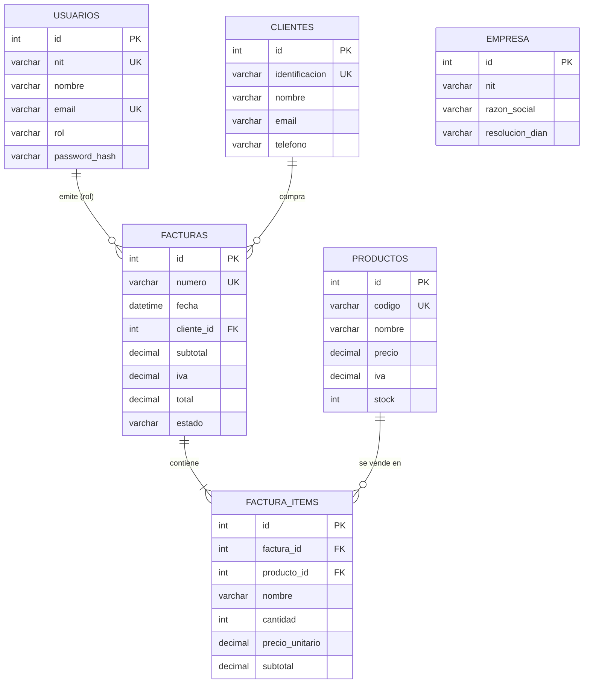

## 1. Tecnologías y stack utilizado

| Componente           | Tecnología                                  |
| -------------------- | ------------------------------------------- |
| Entorno de ejecución | Node.js                                     |
| Framework de backend | Express.js                                  |
| Base de datos        | MySQL 8 (tablas relacionales)               |
| Driver de BD         | mysql2 (pool de conexiones)                 |
| Autenticación        | JSON Web Token (jsonwebtoken)               |
| Sesión segura        | Cookie httpOnly (cookie-parser)             |
| Cifrado de claves    | bcryptjs                                    |
| Cabeceras de seguridad | helmet                                    |
| Límite de peticiones | express-rate-limit                          |
| Validación de entrada| express-validator                           |
| Variables de entorno | dotenv                                      |
| CORS                 | cors (origen del frontend configurable)     |
| Control de versiones | Git + GitHub                                |

---

## 2. Estructura del proyecto

```
backend/
├── package.json              # Dependencias y scripts
├── .env.example              # Plantilla de variables de entorno
├── .env                      # Configuración local (no se sube a Git)
├── server.js                 # Punto de entrada de la API
├── config/
│   ├── db.js                 # Pool de conexiones MySQL
│   └── jwt.js                # Generación, verificación y revocación de tokens
├── controllers/
│   ├── auth.controller.js    # Inicio de sesión y usuario actual
│   ├── clientes.controller.js
│   ├── productos.controller.js
│   ├── facturas.controller.js # Ventas + facturación electrónica
│   ├── configuracion.controller.js
│   ├── reportes.controller.js
│   ├── usuarios.controller.js
│   ├── errores.controller.js
│   ├── logs.controller.js
│   └── backup.controller.js
├── routes/
│   ├── auth.routes.js
│   ├── clientes.routes.js
│   ├── productos.routes.js
│   ├── facturas.routes.js
│   ├── configuracion.routes.js
│   ├── reportes.routes.js
│   ├── usuarios.routes.js
│   ├── errores.routes.js
│   ├── logs.routes.js
│   └── backup.routes.js
├── middleware/
│   ├── auth.js               # JWT (cookie httpOnly o Bearer) + autorización por rol
│   ├── errorHandler.js       # 404, errores centrales, asyncHandler
│   ├── security.js           # Límites de peticiones (login y general)
│   └── validate.js           # Verificador central de validaciones (400)
├── validators/
│   └── index.js              # Reglas de validación por módulo
├── utils/
│   ├── helpers.js            # Números de factura, IVA, mapeadores, escapes
│   ├── auditoria.js          # Registro de logs de auditoría (con IP real)
│   ├── cune.js               # Generación del hash CUNE (simulación DIAN)
│   └── errores.js            # Registro de errores del sistema
├── services/
│   ├── backup.service.js     # Respaldos y restauración SQL
│   ├── email.service.js      # Envío de facturas por correo (nodemailer)
│   └── pdf.service.js        # Generación de PDF (PDFKit)
├── db/
│   ├── schema.sql            # Creación de BD y tablas
│   └── seedData.js           # Datos por defecto (semejantes al frontend)
├── scripts/
│   ├── setupDb.js            # Preparación en un paso (db:setup)
│   ├── migrate.js            # Migraciones idempotentes (db:migrate)
│   └── seed.js               # Población de datos de ejemplo (db:seed)
└── test/                     # Pruebas unitarias (node --test)
    ├── cune.test.js
    ├── helpers.test.js
    ├── jwt.test.js
    ├── validate.test.js
    └── validators.test.js
```

---

## 3. Modelo de datos



| Tabla          | Descripción                                                              |
| -------------- | ------------------------------------------------------------------------ |
| `usuarios`     | Perfiles de acceso (admin, vendedor, contador) con contraseña cifrada.   |
| `clientes`     | Directorio de clientes (identificación, nombre, email, teléfono).        |
| `productos`    | Catálogo de productos (código, nombre, precio, IVA, stock).              |
| `facturas`     | Cabecera de factura con *snapshot* del cliente y totales calculados.     |
| `factura_items`| Líneas de cada factura (producto, cantidad, precio, IVA, subtotal).      |
| `empresa`      | Datos de la empresa emisora y configuración fiscal DIAN (un registro).   |

> **Nota sobre integridad:** al crear una factura se guarda una copia del nombre e
> identificación del cliente (denormalización). Así el histórico fiscal no cambia si
> el cliente se edita o elimina posteriormente. La eliminación de clientes/productos
> es **lógica** (campo `activo = 0`).

---

## 4. Análisis de endpoints

Todas las rutas (excepto `POST /api/auth/login`, `POST /api/auth/logout` y
`GET /api/health`) exigen autenticación. La API acepta el token JWT de dos formas:

- **Cookie httpOnly `token`** (mecanismo principal, usado por el frontend):
  el navegador la envía automáticamente, sin que JavaScript la lea.
- **Encabezado `Authorization`** (para clientes externos / Postman):

```
Authorization: Bearer <token>
```

La estructura de respuesta es consistente:

```json
// Éxito
{ "success": true, "message": "…", "...datos": … }

// Error
{ "success": false, "message": "Descripción del error." }
```

### 4.1 Autenticación — `/api/auth`

| Método | Ruta            | Protegida | Descripción                                      |
| ------ | --------------- | --------- | ------------------------------------------------ |
| POST   | `/api/auth/login` | No      | Valida NIT y contraseña; emite cookie httpOnly y devuelve el token JWT y el usuario. |
| POST   | `/api/auth/logout` | No     | Cierra la sesión limpiando la cookie httpOnly.   |
| GET    | `/api/auth/me`  | Sí        | Datos del usuario autenticado con el token.      |

**`POST /api/auth/login`**

```json
// Body de entrada
{ "nit": "900.123.456-7", "password": "admin123" }

// Respuesta 200 OK (además fija la cookie httpOnly "token")
{
  "success": true,
  "message": "Inicio de sesion exitoso.",
  "token": "eyJhbGciOiJIUzI1NiIs...",
  "usuario": {
    "id": 1, "nit": "900.123.456-7", "nombre": "Jhon Henry Romero",
    "email": "admin@facturaexpress.co", "telefono": "+57 300 123 4567", "rol": "admin"
  }
}
```

| Código | Situación                         |
| ------ | --------------------------------- |
| 200    | Credenciales válidas.             |
| 401    | Credenciales incorrectas.         |
| 403    | Usuario inactivo.                 |
| 400    | Faltan campos obligatorios.       |
| 429    | Demasiados intentos (5 por IP cada 15 min). |

### 4.2 Clientes — `/api/clientes`

| Método | Ruta             | Protegida | Descripción                                      |
| ------ | ---------------- | --------- | ------------------------------------------------ |
| GET    | `/api/clientes`  | Sí        | Lista clientes con búsqueda y paginación.        |
| GET    | `/api/clientes/:id` | Sí     | Devuelve un cliente por id.                      |
| POST   | `/api/clientes`  | Sí        | Crea un cliente (valida duplicado de identificación). |
| PUT    | `/api/clientes/:id` | Sí     | Actualiza un cliente.                            |
| DELETE | `/api/clientes/:id` | Sí     | Elimina lógicamente un cliente.                  |

**Parámetros del GET de listado** (query string):

| Parámetro | Tipo   | Obligatorio | Descripción                              |
| --------- | ------ | ----------- | ---------------------------------------- |
| `q`       | string | No          | Texto de búsqueda por nombre, identificación o email. |
| `pagina`  | number | No          | Página de resultados (por defecto 1).    |
| `limite`  | number | No          | Registros por página (por defecto 50).   |

**Estructura JSON de un cliente:**

```json
{
  "id": 1,
  "identificacion": "80.123.456-1",
  "nombre": "Constructora Moderna S.A.S",
  "email": "compras@constructoramoderna.com",
  "telefono": "+57 310 234 5678"
}
```

**`POST /api/clientes` — cuerpo de entrada:** `{ identificacion, nombre, email?, telefono? }`

| Código | Situación                                                |
| ------ | -------------------------------------------------------- |
| 201    | Cliente creado.                                          |
| 400    | Faltan identificación o nombre.                          |
| 409    | Ya existe un cliente con esa identificación.             |
| 401    | Sin token o token inválido.                              |

### 4.3 Productos — `/api/productos`

| Método | Ruta                       | Protegida | Descripción                                     |
| ------ | -------------------------- | --------- | ----------------------------------------------- |
| GET    | `/api/productos`           | Sí        | Lista productos con búsqueda y paginación.      |
| GET    | `/api/productos/:id`       | Sí        | Devuelve un producto por id.                    |
| POST   | `/api/productos`           | Sí        | Crea un producto (valida duplicado de código).  |
| PUT    | `/api/productos/:id`       | Sí        | Actualiza un producto.                          |
| PATCH  | `/api/productos/:id/stock` | Sí        | Ajusta el stock sumando/restado unidades.       |
| DELETE | `/api/productos/:id`       | Sí        | Elimina lógicamente un producto.                |

**Estructura JSON de un producto:**

```json
{
  "id": 1, "codigo": "PROD001", "nombre": "Insumo Industrial X",
  "precio": 85000, "iva": 0.19, "stock": 50
}
```

**`PATCH /api/productos/:id/stock`** — cuerpo: `{ "cantidad": 10 }` (positivo suma, negativo resta).

| Código | Situación                                  |
| ------ | ------------------------------------------ |
| 201    | Producto creado.                           |
| 409    | Código de producto duplicado.              |
| 400    | Precio o cantidad inválidos.               |

### 4.4 Ventas y facturación — `/api/facturas`

| Método | Ruta                   | Protegida | Descripción                                      |
| ------ | ---------------------- | --------- | ------------------------------------------------ |
| GET    | `/api/facturas`        | Sí        | Lista facturas con filtros de estado y búsqueda. |
| GET    | `/api/facturas/:id`    | Sí        | Factura completa con sus items.                  |
| POST   | `/api/facturas`        | Sí        | **Finaliza una venta** y genera la factura electrónica. |
| PUT    | `/api/facturas/:id/estado` | Sí    | Actualiza el estado DIAN de una factura.         |
| DELETE | `/api/facturas/:id`    | Sí        | Elimina físicamente una factura pendiente (**restituye el stock**). |
| GET    | `/api/facturas/:id/xml` | Sí       | Genera el XML de la factura (formato DIAN).      |
| GET    | `/api/facturas/:id/csv` | Sí       | Genera el CSV con datos de la factura.           |

**`POST /api/facturas` — finalización de venta.** Lógica de negocio materializada:

1. Valida que el `clienteId` exista y esté activo.
2. Valida los items y sus cantidades contra el catálogo y el **stock disponible**.
3. Calcula **subtotal, IVA (19%) y total** del lado del servidor (no confía en el cliente).
4. Genera el número secuencial `FAC-YYYYMM-XXXXX` **bajo un advisory lock de MySQL** para evitar colisiones en ventas concurrentes.
5. Inserta factura + items y **descuenta el stock** dentro de una **transacción atómica**; si algo falla, revierte todo.

```json
// Body de entrada (descuento es un PORCENTAJE entre 0 y 100)
{
  "clienteId": 1,
  "items": [
    { "productoId": 1, "cantidad": 2 },
    { "productoId": 3, "cantidad": 1 }
  ],
  "descuento": 10
}

// Respuesta 201 Created (el descuento almacenado es el monto en pesos)
{
  "success": true,
  "message": "Venta finalizada: FAC-202608-00001",
  "factura": {
    "id": 1, "numero": "FAC-202608-00001", "fecha": "2026-08-07T05:19:04.000Z",
    "cliente": { "id": 1, "identificacion": "80.123.456-1", "nombre": "Constructora Moderna S.A.S" },
    "subtotal": 420000, "iva": 79800, "descuento": 42000, "total": 457800,
    "estado": "pendiente", "cufe": null,
    "items": [
      { "id": 1, "codigo": "PROD001", "nombre": "Insumo Industrial X", "cantidad": 2,
        "precioUnitario": 85000, "iva": 32300, "subtotal": 170000 },
      { "id": 3, "codigo": "PROD003", "nombre": "Material Premium Z", "cantidad": 1,
        "precioUnitario": 250000, "iva": 47500, "subtotal": 250000 }
    ]
  }
}
```

| Código | Situación                                              |
| ------ | ------------------------------------------------------ |
| 201    | Venta finalizada y factura generada.                   |
| 400    | Datos de entrada inválidos (incluye descuento > 100).  |
| 404    | Cliente no encontrado.                                 |
| 409    | Stock insuficiente para algún producto.                |
| 503    | No se obtuvo el bloqueo de numeración (reintentar).    |

**Estados DIAN válidos** (para el campo `estado`):

```
pendiente | enviada | rechazada
```

**`GET /api/facturas` — parámetros de filtrado:**

| Parámetro | Tipo   | Descripción                                    |
| --------- | ------ | ---------------------------------------------- |
| `estado`  | string | Filtra por estado DIAN (ej: `pendiente`).      |
| `q`       | string | Búsqueda por número de factura o cliente.      |
| `pagina`  | number | Página de resultados.                          |
| `limite`  | number | Registros por página (por defecto 20).         |

### 4.5 Configuración — `/api/configuracion`

| Método | Ruta                        | Protegida | Descripción                                  |
| ------ | --------------------------- | --------- | -------------------------------------------- |
| GET    | `/api/configuracion`        | Sí        | Datos de la empresa y configuración fiscal.  |
| PUT    | `/api/configuracion/empresa`| Sí        | Actualiza datos de la empresa.               |
| PUT    | `/api/configuracion/fiscal` | Sí        | Actualiza resolución DIAN y vigencia del certificado. |
| POST   | `/api/configuracion/dian/sync` | Sí    | Simula sincronización con la DIAN.           |

### 4.6 Reportes — `/api/reportes`

| Método | Ruta                                  | Protegida | Descripción                                      |
| ------ | ------------------------------------- | --------- | ------------------------------------------------ |
| GET    | `/api/reportes/kpis`                  | Sí        | Indicadores: ventas del día, ticket promedio, pendientes DIAN, avance de meta, etc. |
| GET    | `/api/reportes/ventas-semanales`      | Sí        | Ventas por día de los últimos 7 días.            |
| GET    | `/api/reportes/ventas-periodo?periodo=mensual` | Sí | Ventas agrupadas por periodo (semanal, mensual, trimestral, anual). |
| GET    | `/api/reportes/productos-top?limite=5` | Sí       | Productos más vendidos.                          |
| GET    | `/api/reportes/ultimas-transacciones?limite=4` | Sí | Últimas facturas emitidas.                       |

**Respuesta de `GET /api/reportes/kpis`:**

```json
{
  "success": true,
  "kpis": {
    "ventasDia": 494800, "facturasEmitidasHoy": 1, "facturasEmitidas": 1,
    "pendientesDIAN": 0, "ticketPromedio": 494800, "ventasMes": 494800,
    "clientesNuevos": 5, "productosVendidos": 3,
    "metaVentasMensual": 6400000, "avanceMeta": 8
  }
}
```

---

## 5. Usuarios de prueba (seed)

| Rol       | NIT            | Contraseña      |
| --------- | -------------- | --------------- |
| admin     | `900.123.456-7`| `admin123`      |
| vendedor  | `80.987.654-3` | `vendedor123`   |
| contador  | `70.555.444-2` | `contador123`   |

---

## 6. Instalación y puesta en marcha

> **Monorepositorio:** estos pasos son solo para trabajar directamente dentro
> de `backend/`. Desde la raíz del repositorio puede usar los scripts
> orquestados: `npm run setup` (primera vez) y `npm run dev` (levanta API y
> frontend juntos). Ver el README raíz, sección 7.

### Requisitos
- Node.js ≥ 20 (la CI usa Node 22)
- MySQL 8 corriendo localmente

### Paso 1 — Configurar variables de entorno

```bash
cd backend
cp .env.example .env
# Editar .env con las credenciales de MySQL locales
```

### Paso 2 — Instalar dependencias

```bash
npm install
```

### Paso 3 — Crear base de datos, tablas y datos de ejemplo

```bash
npm run db:setup
```

> El script ejecuta `db/schema.sql` (crea la BD `facturaexpress_apirest` y sus tablas)
> y luego puebla empresa, usuarios, clientes y productos.

### Paso 4 — Iniciar la API

```bash
npm start        # Producción
npm run dev      # Desarrollo (nodemon, recarga automática)
```

La API queda disponible en `http://localhost:4000` (verificar en `http://localhost:4000/api/health`).

---

## 7. Pruebas con cURL

```bash
# 1. Iniciar sesión y guardar el token
TOKEN=$(curl -s -X POST http://localhost:4000/api/auth/login \
  -H "Content-Type: application/json" \
  -d '{"nit":"900.123.456-7","password":"admin123"}' \
  | node -pe "JSON.parse(require('fs').readFileSync(0)).token")

# 2. Listar clientes
curl -s http://localhost:4000/api/clientes -H "Authorization: Bearer $TOKEN"

# 3. Crear una venta / factura
curl -s -X POST http://localhost:4000/api/facturas \
  -H "Authorization: Bearer $TOKEN" -H "Content-Type: application/json" \
  -d '{"clienteId":1,"items":[{"productoId":1,"cantidad":2}]}'

# 4. Descargar el XML de la factura 1
curl -s http://localhost:4000/api/facturas/1/xml -H "Authorization: Bearer $TOKEN"

# 5. Reportes
curl -s http://localhost:4000/api/reportes/kpis -H "Authorization: Bearer $TOKEN"
```

---

## 8. Buenas prácticas aplicadas

- **Nombres descriptivos** en rutas, controladores, variables y métodos.
- **Comentarios técnicos** en JSDoc explicando la función de cada módulo y controlador.
- **Separación de responsabilidades**: `routes` → `controllers` → `config`/`middleware`/`utils`.
- **Manejo centralizado de errores** con respuestas JSON consistentes (`success`/`message`).
- **Transacciones** para operaciones de escritura múltiple (factura + items + stock).
- **Validación de entrada** en el servidor (no se confía en los datos del cliente).
- **Seguridad**: contraseñas cifradas con `bcryptjs`, tokens JWT con expiración,
  cookie de sesión httpOnly, `Authorization` requerida en las rutas protegidas,
  CORS restringido al origen del frontend, validación de entrada, cabeceras de
  seguridad (helmet) y límite de peticiones.
- **Variables de entorno** para credenciales y configuración (`.env` excluido de Git).
- **Idempotencia del seed** y eliminación lógica para preservar el histórico fiscal.

---

## 9. Seguridad

Medidas implementadas para proteger la API:

| Medida | Detalle |
| ------ | ------- |
| **Cookie httpOnly** | El token JWT viaja en la cookie `token` con `HttpOnly` y `SameSite=Lax`, inmune a XSS (JavaScript no puede leerla). El frontend no almacena el token. |
| **Cookie `Secure`** | Con `NODE_ENV=production` la cookie solo viaja por HTTPS. |
| **Helmet** | Cabeceras HTTP de seguridad: CSP, `X-Frame-Options`, `X-Content-Type-Options`, HSTS, etc. (`server.js`). |
| **Límite de peticiones** | Login: 5 intentos/15 min por IP (`loginLimiter`). API general: 120 peticiones/min por IP (`apiLimiter`). Responden `429`. |
| **Validación de entrada** | `express-validator` (`validators/index.js`) valida tipos, formatos y rangos antes del controlador; responde `400` con la lista de campos (`middleware/validate.js`). |
| **Errores sin detalles** | En producción los errores `500` devuelven *"Error interno del servidor."*; el detalle (SQL, rutas) solo se registra en consola (`middleware/errorHandler.js`). |
| **Secreto JWT obligatorio** | Con `NODE_ENV=production` la API **no arranca** si falta `JWT_SECRET` (`config/jwt.js`), evitando tokens falsificables con un valor por defecto. |
| **Consultas parametrizadas** | `mysql2` con `?` en todos los queries (anti-SQL injection). |
| **Cifrado de contraseñas** | `bcryptjs` (nunca se guardan en texto plano). |
| **CORS restringido** | Solo el origen del frontend (`CORS_ORIGIN`) puede consumir la API con credenciales. |

> **Variables relevantes**: `NODE_ENV` (development/production), `JWT_SECRET`
> (obligatorio en producción), `JWT_EXPIRES_IN`, `CORS_ORIGIN`, `TRUST_PROXY`
> (saltos de proxy inverso; sin configurarlo, el rate limit y la auditoría verían la IP del proxy).

---

## 10. Registro de servicios web (resumen)

| # | Módulo         | Método | Ruta                                 | Función principal                          |
| - | -------------- | ------ | ------------------------------------ | ------------------------------------------ |
| 1 | Autenticación  | POST   | `/api/auth/login`                    | Iniciar sesión y emitir token JWT.         |
| 2 | Autenticación  | GET    | `/api/auth/me`                       | Consultar usuario autenticado.             |
| 3 | Clientes       | GET    | `/api/clientes`                      | Listar/buscar clientes.                    |
| 4 | Clientes       | GET    | `/api/clientes/:id`                  | Consultar un cliente.                      |
| 5 | Clientes       | POST   | `/api/clientes`                      | Registrar cliente.                         |
| 6 | Clientes       | PUT    | `/api/clientes/:id`                  | Actualizar cliente.                        |
| 7 | Clientes       | DELETE | `/api/clientes/:id`                  | Eliminar cliente.                          |
| 8 | Productos      | GET    | `/api/productos`                     | Listar/buscar productos.                   |
| 9 | Productos      | GET    | `/api/productos/:id`                 | Consultar un producto.                     |
| 10| Productos      | POST   | `/api/productos`                     | Registrar producto.                        |
| 11| Productos      | PUT    | `/api/productos/:id`                 | Actualizar producto.                       |
| 12| Productos      | PATCH  | `/api/productos/:id/stock`           | Ajustar stock.                             |
| 13| Productos      | DELETE | `/api/productos/:id`                 | Eliminar producto.                         |
| 14| Facturación    | GET    | `/api/facturas`                      | Listar facturas (filtros + búsqueda).      |
| 15| Facturación    | GET    | `/api/facturas/:id`                  | Consultar factura con items.               |
| 16| Facturación    | POST   | `/api/facturas`                      | Finalizar venta y generar factura.         |
| 17| Facturación    | PUT    | `/api/facturas/:id/estado`           | Actualizar estado DIAN.                    |
| 18| Facturación    | DELETE | `/api/facturas/:id`                  | Eliminar factura pendiente (restituye stock). |
| 19| Facturación    | GET    | `/api/facturas/:id/xml`              | Generar XML DIAN de la factura.            |
| 20| Facturación    | GET    | `/api/facturas/:id/csv`              | Generar CSV de la factura.                 |
| 21| Configuración  | GET    | `/api/configuracion`                 | Consultar empresa y configuración fiscal.  |
| 22| Configuración  | PUT    | `/api/configuracion/empresa`         | Actualizar datos de la empresa.            |
| 23| Configuración  | PUT    | `/api/configuracion/fiscal`          | Actualizar configuración fiscal DIAN.      |
| 24| Configuración  | POST   | `/api/configuracion/dian/sync`       | Sincronizar con la DIAN.                   |
| 25| Reportes       | GET    | `/api/reportes/kpis`                 | Indicadores clave del negocio.             |
| 26| Reportes       | GET    | `/api/reportes/ventas-semanales`     | Ventas de los últimos 7 días.              |
| 27| Reportes       | GET    | `/api/reportes/ventas-periodo`       | Ventas comparadas por periodo.             |
| 28| Reportes       | GET    | `/api/reportes/productos-top`        | Productos más vendidos.                    |
| 29| Reportes       | GET    | `/api/reportes/ultimas-transacciones`| Últimas facturas emitidas.                 |

---

## 11. Control de versiones (Git)

```bash
# Desde la raíz del proyecto
git init
git add backend/
git commit -m "feat: API REST de FacturaExpress (Express + MySQL + JWT)"
git remote add origin https://github.com/<usuario>/Proyecto-FacturaExpress-React.git
git push -u origin main
```

> El archivo `backend/.env` debe permanecer fuera del repositorio (ya está incluido
> en el `.gitignore` raíz como `.env.local`, agregar `backend/.env` si es necesario).
