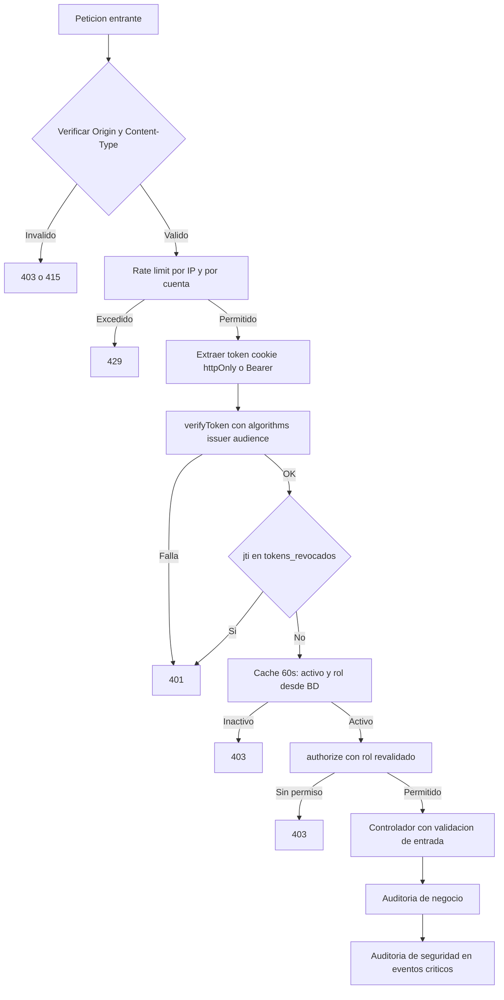

# Auditoría de seguridad del backend — FacturaExpress V3

Alcance: API REST Express ([`../backend/server.js`](../backend/server.js:1)), autenticación/autorización, validación de entrada, rate limiting, manejo de errores, respaldos y despliegue.
Método: revisión estática de código y configuración (OWASP ASVS / Top 10 como referencia). No incluye pentest dinámico.

---

## 1. Resumen ejecutivo

El backend tiene una base de seguridad **por encima del promedio** para un proyecto académico: cabeceras con Helmet, cookies httpOnly, revocación de JWT por `jti`, rate limiting diferenciado y consultas parametrizadas en todos los módulos.

Las brechas se concentran en tres frentes:

1. **Ciclo de vida de la sesión**: el rol viaja en el token y no se revalida contra la base de datos; el JWT no fija algoritmo emisor/audiencia; el login devuelve el token en el cuerpo.
2. **Defensa en profundidad de entrada**: política de contraseñas débil, rate limit de login solo por IP, ausencia de verificación de `Origin` (CSRF) y de `Content-Type`.
3. **Infraestructura y datos**: sin TLS en el stack Docker, secretos de MySQL visibles en la línea de comandos, restauración de respaldos con `multipleStatements` y validación de nombres de archivo solo por `basename`.

No se identificaron vulnerabilidades **críticas** (no hay inyección SQL explotable, secretos hardcodeados en producción ni ejecución de código remoto).

---

## 2. Fortalezas confirmadas (mantener)

| Control                                                                        | Evidencia                                                                                                                                                   |
| ------------------------------------------------------------------------------ | ----------------------------------------------------------------------------------------------------------------------------------------------------------- |
| Cabeceras HTTP de seguridad                                                    | [`helmet()`](../backend/server.js:58), CSP en nginx [`nginx.conf`](../frontend/nginx.conf:35)                                                               |
| Cookie httpOnly + Secure en producción + SameSite                              | [`auth.controller.js`](../backend/controllers/auth.controller.js:65)                                                                                        |
| `JWT_SECRET` obligatorio en producción; aleatorio en desarrollo                | [`jwt.js`](../backend/config/jwt.js:18)                                                                                                                     |
| Revocación de sesión por `jti` con tabla dedicada                              | [`auth.js`](../backend/middleware/auth.js:93), [`schema.sql`](../backend/db/schema.sql:211)                                                                 |
| Rate limiting escalonado (login 5/15min, 120/min anónimo, 600/min autenticado) | [`security.js`](../backend/middleware/security.js:28)                                                                                                       |
| `trust proxy` configurable + IP real en auditoría                              | [`server.js`](../backend/server.js:47), [`auditoria.js`](../backend/utils/auditoria.js:19)                                                                  |
| Validación centralizada con express-validator                                  | [`validate.js`](../backend/middleware/validate.js:20), [`validators/index.js`](../backend/validators/index.js:1)                                            |
| Consultas parametrizadas (sin SQL dinámico de usuario)                         | [`facturas.controller.js`](../backend/controllers/facturas.controller.js:78), [`reportes.controller.js`](../backend/controllers/reportes.controller.js:106) |
| `express.urlencoded({ extended: false })` para reducir superficie de parsing   | [`server.js`](../backend/server.js:66)                                                                                                                      |
| Cache de estado `activo` con TTL 60s y bloqueo de auto-borrado                 | [`auth.js`](../backend/middleware/auth.js:18), [`usuarios.controller.js`](../backend/controllers/usuarios.controller.js:219)                                |
| Mitigación de path traversal en respaldos                                      | [`backup.service.js`](../backend/services/backup.service.js:37)                                                                                             |
| Secretos exigidos por Compose con `${VAR:?}`                                   | [`docker-compose.yml`](../docker-compose.yml:45)                                                                                                            |
| El frontend no persiste el token (solo el perfil en sessionStorage)            | [`auth.service.ts`](../frontend/src/app/core/auth.service.ts:83)                                                                                            |

---

## 3. Hallazgos priorizados

### A1 · Rol no revalidado desde la base de datos — Alto

- **Evidencia**: [`auth.js`](../backend/middleware/auth.js:133) construye `req.usuario` con `payload.rol`; solo `activo` se refresca cada 60 s.
- **Impacto**: si un administrador degrada o cambia el rol de un usuario, el token anterior conserva los privilegios originales hasta su expiración (hasta 8 h). Escalada de privilegios residual.
- **Remediación**: leer `rol` y `activo` en la misma consulta cacheada y emitir `req.usuario.rol` desde ese resultado; invalidar la entrada de caché en `updateUsuario`, `toggleActivo` y `deleteUsuario` (o revocar tokens del usuario).

### A2 · JWT sin restricciones de algoritmo, emisor ni audiencia — Alto

- **Evidencia**: [`jwt.js`](../backend/config/jwt.js:68) (sign) y [`jwt.js`](../backend/config/jwt.js:79) (verify).
- **Impacto**: superficie para ataques de confusión de algoritmo y reutilización del token en otro contexto.
- **Remediación**: `algorithm: 'HS256'` al firmar; en verificación `algorithms: ['HS256']`, `issuer` y `audience` fijos; rechazar tokens sin `jti`.

### A3 · El login devuelve el token en el cuerpo de la respuesta — Medio/Alto

- **Evidencia**: [`auth.controller.js`](../backend/controllers/auth.controller.js:77).
- **Impacto**: aumenta la exposición del token a XSS y permite que consumidores lo persistan en `localStorage`.
- **Remediación**: devolver el token solo cuando se solicite explícitamente para clientes externos (por ejemplo `POST /api/auth/login?modo=bearer` o cabecera `X-Token-Response: true`), o restringirlo a entornos no productivos. El frontend ya no lo necesita.

### A4 · Sin defensa CSRF explícita — Medio/Alto

- **Evidencia**: `sameSite: 'lax'` en [`auth.controller.js`](../backend/controllers/auth.controller.js:68); no hay verificación de `Origin`/`Referer` ni token anti-CSRF.
- **Impacto**: mutaciones navales protegidas por Lax, pero cualquier endpoint `GET` con efectos o futuras rutas con `sameSite: 'none'` quedan expuestas. La cookie viaja automáticamente con `credentials: true` ([`server.js`](../backend/server.js:60)).
- **Remediación**: middleware que valide `Origin` contra `CORS_ORIGIN` en métodos de mutación y evaluar `sameSite: 'strict'`.

### A5 · Ausencia de TLS en el stack de despliegue — Alto

- **Evidencia**: nginx escucha en `80` ([`nginx.conf`](../frontend/nginx.conf:5)); Compose publica `4200:80` ([`docker-compose.yml`](../docker-compose.yml:67)).
- **Impacto**: con `COOKIE_SECURE = true` en producción, la cookie no se transmite por HTTP → sesiones rotas o tentación de desactivar `secure` (peor). Además, credenciales y tokens en claro.
- **Remediación**: terminar TLS en nginx (certificados + redirección 301 + HSTS), `X-Forwarded-Proto` ya se propaga.

### A6 · Contraseña de MySQL visible en la línea de comandos — Medio

- **Evidencia**: `mysqladmin ping ... -p${MYSQL_ROOT_PASSWORD}` ([`docker-compose.yml`](../docker-compose.yml:27)).
- **Impacto**: el secreto queda expuesto en la tabla de procesos y en `docker inspect`.
- **Remediación**: usar `--defaults-extra-file` temporal, `MYSQL_PWD` desde entorno, o un usuario de healthcheck sin privilegios.

### A7 · Política de contraseñas débil — Medio

- **Evidencia**: mínimo 6 caracteres sin más requisitos ([`validators/index.js`](../backend/validators/index.js:216), [`usuarios.controller.js`](../backend/controllers/usuarios.controller.js:18)). El login no limita la longitud ([`validators/index.js`](../backend/validators/index.js:17)).
- **Impacto**: contraseñas triviales y coste de CPU predecible al procesar cuerpos grandes con bcrypt.
- **Remediación**: mínimo 10–12 caracteres con verificación de complejidad, longitud máxima de 128 en login, y cierre de sesiones al cambiar contraseña.

### A8 · Rate limit de login únicamente por IP — Medio

- **Evidencia**: [`security.js`](../backend/middleware/security.js:28).
- **Impacto**: ataques distribuidos evaden el límite; en redes NAT los usuarios legítimos comparten cuota (bloqueo de disponibilidad).
- **Remediación**: clave compuesta por `nit` + IP, `skipSuccessfulRequests: true`, backoff progresivo por cuenta y registro de fallos para auditoría de seguridad.

### A9 · Restauración de respaldos con `multipleStatements` y cabecera falsificable — Medio

- **Evidencia**: [`backup.service.js`](../backend/services/backup.service.js:164) (marca textual) y [`backup.service.js`](../backend/services/backup.service.js:176).
- **Impacto**: cualquier archivo `.sql` que incluya la cadena de cabecera se ejecuta completo con credenciales de la aplicación (incluidas sentencias DDL/DML arbitrarias).
- **Remediación**: hash/checksum del respaldo verificado antes de restaurar, exigencia de confirmación explícita, usuario de BD con privilegios mínimos y registro en auditoría de alto nivel.

### A10 · Nombre de archivo de respaldo sin validar en rutas — Medio

- **Evidencia**: `GET /api/backups/:archivo/download` y `DELETE /api/backups/:archivo` sin validador ([`backup.routes.js`](../backend/routes/backup.routes.js:24)); `res.download(ruta, req.params.archivo)` ([`backup.controller.js`](../backend/controllers/backup.controller.js:89)).
- **Impacto**: el nombre entra en la cabecera `Content-Disposition`; una entrada inesperada puede degradar la respuesta (el path traversal ya está mitigado por `basename`).
- **Remediación**: validador `^backup_\d{14}\.sql$` y usar siempre el nombre resuelto desde el servicio.

### A11 · Ausencia de auditoría de eventos de seguridad — Medio

- **Evidencia**: [`auditoria.js`](../backend/utils/auditoria.js:32) registra solo CRUD de negocio; no hay trazas de login fallido, bloqueos por rate limit, cambios de rol ni restauraciones.
- **Impacto**: sin trazabilidad forense ante incidentes.
- **Remediación**: registrar eventos de seguridad (sin contraseñas ni tokens) y exponerlos al módulo de auditoría.

### A12 · Privilegios amplios por rol en módulos sensibles — Medio

- **Evidencia**: facturas permite a cualquier autenticado eliminar y cambiar estado DIAN ([`facturas.routes.js`](../backend/routes/facturas.routes.js:37)); reportes sin restricción de rol ([`reportes.routes.js`](../backend/routes/reportes.routes.js:23)); clientes/productos sin distinción de rol.
- **Impacto**: un `vendedor` puede borrar facturas o alterar su estado fiscal; principio de menor privilegio no aplicado.
- **Remediación**: matriz de permisos por rol (eliminar/estado → admin; reportes → admin y contador; POS → admin y vendedor) y pruebas de autorización negativas.

### A13 · Endurecimiento de contenedores pendiente de verificar — Medio

- **Evidencia**: `db` usa root en el healthcheck; el `command` del API ejecuta seed + migrate en producción ([`docker-compose.yml`](../docker-compose.yml:55)); falta confirmar usuario no root y flags en el Dockerfile.
- **Remediación**: `USER node`, `npm ci --omit=dev`, healthcheck propio, separación de tareas de migración y usuario de BD con privilegios mínimos para el runtime.

### A14 · Inconsistencia de `CORS_ORIGIN` entre código y plantilla — Bajo

- **Evidencia**: por defecto `http://localhost:4200` ([`server.js`](../backend/server.js:38)) vs `http://localhost:3000` ([`../backend/.env.example`](../backend/.env.example:13)). El listado del workspace sugiere que el .env de la raíz no existe.
- **Remediación**: unificar en 4200 y documentar el `.env` raíz de Compose.

### A15 · Defensa en profundidad de entrada incompleta — Bajo

- **Evidencia**: sin verificación de `Content-Type` en mutaciones ([`server.js`](../backend/server.js:63)); el manejador de errores no diferencia errores de cuerpo malformado ([`errorHandler.js`](../backend/middleware/errorHandler.js:34)).
- **Remediación**: rechazar tipos inesperados, responder 400 específico a JSON inválido y asegurar 415 para tipos no soportados.

### A16 · Rate limit con almacén en memoria — Bajo

- **Evidencia**: [`security.js`](../backend/middleware/security.js:12) sin `store`.
- **Impacto**: los límites se reinician por instancia y no se comparten en escalado horizontal.
- **Remediación**: documentar la limitación o migrar a almacén compartido (Redis) si se escala.

---

## 4. Flujo de autenticación con los puntos de endurecimiento

---

## 5. Plan de ejecución por fases

### Fase 0 — Línea base y reproducción

1. Ejecutar `npm audit` en `backend` y `frontend`, y registrar resultados.
2. Verificar cabeceras reales con `curl -I` / `Invoke-WebRequest` sobre `/api/health` y una ruta 404.
3. Confirmar comportamiento ante JSON malformado, `Content-Type: text/plain` y `Authorization` inválido.
4. Revisar `backend/Dockerfile` y `frontend/Dockerfile` (usuario, flags de instalación, healthcheck).

### Fase 1 — Sesión y token (A1, A2, A3)

5. Fijar `algorithm: 'HS256'`, `issuer` y `audience` en firma y verificación; rechazar tokens sin `jti`.
6. Extender la caché de `authenticate` para incluir `rol` y usar ese valor en `req.usuario`.
7. Invalidar la caché de usuario al actualizar rol, desactivar o eliminar; revocar sus tokens vigentes.
8. Hacer opcional la devolución del token en el login (Bearer explícito) manteniendo el contrato de Postman.

### Fase 2 — Autorización por rol (A12)

9. Definir matriz de permisos por rol y aplicarla en facturas, reportes, clientes y productos.
10. Añadir pruebas negativas 403 por rol en la colección Postman y en `node --test`.

### Fase 3 — Defensas de entrada (A4, A7, A8, A15)

11. Middleware de validación de `Origin`/`Referer` en métodos de mutación; decidir política `sameSite`.
12. Endurecer login: longitud máxima, `skipSuccessfulRequests`, límite por `nit`+IP y backoff progresivo.
13. Política de contraseñas: mínimo 10–12, complejidad, bloqueo de reutilización, cambio de contraseña con revocación de sesiones.
14. Validar `Content-Type` en mutaciones y mapear errores de parsing a 400/415 consistentes.

### Fase 4 — Datos y respaldos (A9, A10)

15. Validar `:archivo` con patrón estricto en rutas de backup y sanear `Content-Disposition`.
16. Verificar checksum del respaldo antes de restaurar, exigir confirmación y auditar la operación.
17. Documentar/implementar credenciales de BD con privilegios mínimos para runtime y para restauración.

### Fase 5 — Infraestructura (A5, A6, A13, A14, A16)

18. TLS en nginx: certificados, redirección a HTTPS y HSTS; revisar `secure`/`sameSite` de la cookie.
19. Sacar secretos de la línea de comandos en Compose y revisar healthchecks.
20. Endurecer imágenes: usuario no root, `npm ci --omit=dev`, healthcheck propio, migración fuera del arranque de producción.
21. Unificar `CORS_ORIGIN` y documentar el `.env` raíz de Compose; evaluar almacén compartido de rate limit.

### Fase 6 — Observabilidad y documentación (A11)

22. Registrar eventos de seguridad (login fallido, bloqueo, cambio de rol, restauración) sin datos sensibles.
23. Revisar que `errores_sistema` y `logs_auditoria` no almacenen tokens, contraseñas ni cuerpos completos.
24. Actualizar README/`.env.example` con el modelo de amenazas y la configuración de producción.

### Fase 7 — Verificación y regresión

25. Ejecutar `npm test` en ambos paquetes y la colección Postman completa con Newman.
26. Repetir verificación de cabeceras y casos negativos (401, 403, 415, 429).
27. Registrar el informe de cierre con hallazgos resueltos y aceptados.

---

## 6. Criterios de aceptación

- Token emitido con HS256, `issuer`, `audience` y `jti`; verificación estricta y rechazo de tokens sin `jti`.
- Cambio de rol o desactivación invalida el acceso efectivo en menos de 60 s, sin esperar la expiración.
- Todas las rutas de mutación restringidas según la matriz de roles, con pruebas negativas que devuelven 403.
- Login limitado por cuenta e IP, con contraseña máxima de 128 caracteres y respuestas uniformes sin filtración de existencia de usuario.
- Suite de pruebas (backend + Postman/Newman) en verde y sin hallazgos críticos o altos abiertos distintos de los aceptados por escrito.

## 7. Riesgos y supuestos

- Los cambios en el contrato del login pueden afectar [`postman/collections/FacturaExpress-API-Express.postman_collection.json`](../postman/collections/FacturaExpress-API-Express.postman_collection.json); se mantiene compatibilidad si el token sigue disponible bajo solicitud explícita.
- TLS y endurecimiento de contenedores dependen de la plataforma de despliegue final, aún no definida.
- El endurecimiento del rol en `req.usuario` requiere invalidación de caché; sin ella se introduciría una ventana de privilegios residuales de 60 s.

---

## 8. Informe de cierre

Fecha de cierre: 2026-09-14. Todas las fases del plan fueron ejecutadas y verificadas.

### 8.1 Estado de los hallazgos

| Hallazgo                              | Estado                     | Evidencia de la remediación                                                                                                                   |
| ------------------------------------- | -------------------------- | --------------------------------------------------------------------------------------------------------------------------------------------- |
| A1 Rol no revalidado                  | **Resuelto**               | [`auth.js`](../backend/middleware/auth.js:120) consulta `activo`, `rol` y `token_version`; los controladores de usuarios invalidan la caché   |
| A2 JWT sin algoritmo/emisor/audiencia | **Resuelto**               | [`jwt.js`](../backend/config/jwt.js:88) firma con HS256, `issuer`, `audience` y `jti` obligatorio                                             |
| A3 Token en el cuerpo del login       | **Resuelto**               | [`auth.controller.js`](../backend/controllers/auth.controller.js:27) exige `X-Token-Response` o `?incluirToken`                               |
| A4 Ausencia de defensa CSRF           | **Resuelto**               | [`hardening.js`](../backend/middleware/hardening.js:52) valida el `Origin`; CORS con lista blanca de orígenes                                 |
| A5 Stack sin TLS                      | **Mitigado**               | [`nginx-ssl.conf`](../frontend/nginx-ssl.conf:1) con HTTPS, redirección y HSTS; configuración documentada                                     |
| A6 Secreto de MySQL en la CLI         | **Resuelto**               | [`docker-compose.yml`](../docker-compose.yml:70) usa `MYSQL_PWD` en el healthcheck                                                            |
| A7 Política de contraseñas débil      | **Resuelto**               | Mínimo 10 caracteres con complejidad, bcrypt costo 12, máximo 128 en el login                                                                 |
| A8 Rate limit solo por IP             | **Resuelto**               | [`security.js`](../backend/middleware/security.js:41) usa clave `IP + NIT` y `skipSuccessfulRequests`                                         |
| A9 Restauración sin integridad        | **Resuelto**               | Checksum SHA-256, confirmación explícita y credenciales dedicadas (`DB_RESTORE_USER`)                                                         |
| A10 Nombre de respaldo sin validar    | **Resuelto**               | Patrón `^backup_\d{14}\.sql$` y `Content-Disposition` con el nombre resuelto en el servidor                                                   |
| A11 Sin auditoría de seguridad        | **Resuelto**               | `registrarEventoSeguridad` registra login, bloqueo y cambios críticos en la tabla `seguridad`                                                 |
| A12 Privilegios amplios por rol       | **Resuelto**               | Matriz de permisos aplicada en clientes, productos, facturas, reportes, usuarios, errores, logs y respaldos                                             |
| A13 Contenedores sin endurecer        | **Resuelto**               | [`Dockerfile`](../backend/Dockerfile:23) con `USER node` y healthcheck; migración en servicio `api-init`                                      |
| A14 CORS inconsistente                | **Resuelto**               | `.env.example` de raíz y backend unificados en `http://localhost:4200`                                                                        |
| A15 Defensa de entrada incompleta     | **Resuelto**               | `exigirJson` responde 415; JSON malformado responde 400                                                                                       |
| A16 Rate limit en memoria             | **Aceptado y documentado** | Nota en [`security.js`](../backend/middleware/security.js:1) y en [`docs/Seguridad_FacturaExpress.md`](../docs/Seguridad_FacturaExpress.md:1) |

### 8.2 Verificación ejecutada

| Prueba                                   | Resultado                                                           |
| ---------------------------------------- | ------------------------------------------------------------------- |
| `npm audit` (backend)                    | 0 vulnerabilidades                                                  |
| `npm audit` (frontend)                   | 1 moderada (`hono`) resuelta con `npm audit fix`; 0 al cierre       |
| `npm test` (backend, `node --test`)      | 57 pruebas correctas (incluye autorización, JWT endurecido y saneo) |
| `npx ng test --watch=false` (frontend)   | 1 prueba correcta                                                   |
| `node scripts/security-check.js`         | 26/26 comprobaciones dinámicas correctas                            |
| `node run-integration-tests.js` (Newman) | 56 peticiones y 91 aserciones, 0 fallos                             |
| `npm run db:migrate`                     | Columnas `usuarios.token_version` y `backups.checksum` aplicadas    |

### 8.3 Entregables nuevos

- [`backend/middleware/hardening.js`](../backend/middleware/hardening.js:1) — validación de origen y Content-Type.
- [`backend/utils/sanitizar.js`](../backend/utils/sanitizar.js:1) — redacción de datos sensibles en bitácoras.
- [`backend/scripts/security-check.js`](../backend/scripts/security-check.js:1) — verificación dinámica de 26 controles.
- [`postman/run-integration-tests.js`](../postman/run-integration-tests.js:1) — ejecuta la colección con Newman contra una API local.
- [`frontend/nginx-ssl.conf`](../frontend/nginx-ssl.conf:1) — configuración TLS de referencia.
- [`.env.example`](../.env.example:1) — plantilla de secretos para Docker Compose.
- [`docs/Seguridad_FacturaExpress.md`](../docs/Seguridad_FacturaExpress.md:1) — modelo de amenazas y guía de producción.
- Pruebas nuevas: [`authorize.test.js`](../backend/test/authorize.test.js:1) y [`sanitizar.test.js`](../backend/test/sanitizar.test.js:1).

### 8.4 Cambios de contrato para clientes de la API

| Endpoint                                                                       | Cambio                                                                                       |
| ------------------------------------------------------------------------------ | -------------------------------------------------------------------------------------------- |
| `POST /api/auth/login`                                                         | El token solo viaja en el cuerpo si se envía `X-Token-Response: true` o `?incluirToken=true` |
| `POST /api/backups/restaurar`                                                  | Requiere `{ "archivo": "...", "confirmar": true }` y respaldo con checksum válido            |
| Mutaciones con cuerpo no JSON                                                  | Responden 415 en lugar de procesar el contenido                                              |
| Mutaciones desde otro origen                                                   | Responden 403 si el `Origin` no está autorizado                                              |
| Tokens sin `jti`, con otro emisor/audiencia o versión de sesión desactualizada | Responden 401 (las sesiones previas al despliegue deben renovarse)                           |

### 8.5 Recomendaciones siguientes

1. Ejecutar un pentest dinámico (OWASP ZAP) contra un entorno de pruebas cuando exista despliegue estable.
2. Configurar almacén compartido de rate limiting si se despliegan varias réplicas.
3. Automatizar `npm audit`, `node scripts/security-check.js` y la colección Newman en un flujo de integración continua.
4. Revisar la política de respaldos (rotación y cifrado en reposo) según los requisitos de retención.
